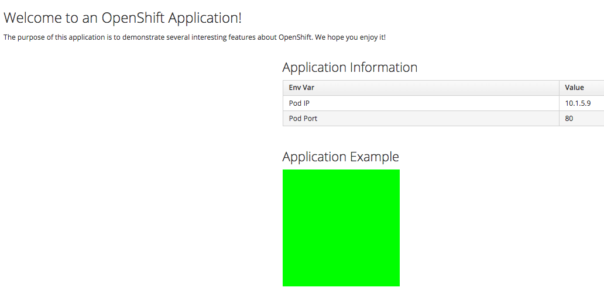
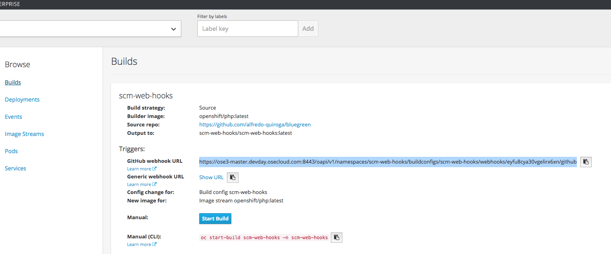
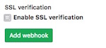

[[scm-web-hooks]]
SCM Web Hooks
~~~~~~~~~~~~~

OpenShift offers several mechanisms to trigger the automatic deployment
of applications. In this Lab, we will demonstrate the deployment of a
very simple application via a GitHub Web Hook trigger.

[[part-i]]
Part I
~~~~~~

In Part I of the Lab we will:

* Create a new project.
* Deploy an application using a source to image strategy.
* Create a route to expose the newly deployed application.

*Step 1: Create new project*

*Remember* to substitute the UserName

....
$ oc new-project scm-web-hooks-UserName --display-name="Test WebHooks"
....

*Step 2: Create new application*

* We will use the forked repository from the previous lab.

*Remember* to substitute the UserName.

....
$ oc new-app --image-stream=php --code=https://github.com/your_github_username/bluegreen.git --name=scm-web-hooks
....

*Step 3: Look at some of the created resources*

* Build configuration

....
$ oc get bc
....

* Deployment configuration

....
$ oc get dc
....

* Show created service

....
$ oc get service
....

* Show replication controller

....
$ oc get rc
....

* Show route

....
$ oc get route
....

Notice that there is no route created yet for this application.

* Show the builds in progress (Running)

....
$ oc get builds
NAME              TYPE      STATUS    POD
scm-web-hooks-1   Source    Running   scm-web-hooks-1-build
....

* Monitor the build

....
$ oc logs build/scm-web-hooks-1
....

The build should finish similar to:

....
Pushing image 172.30.89.28:5000/scm-web-hooks-admin/scm-web-hooks:latest ...
Pushed 0/5 layers, 2% complete
Pushed 1/5 layers, 22% complete
Pushed 2/5 layers, 44% complete
Pushed 3/5 layers, 70% complete
Pushed 3/5 layers, 100% complete
Pushed 4/5 layers, 100% complete
Pushed 5/5 layers, 100% complete
Push successful
....

*Step 4: Create a route*

....
$ oc get service

NAME            CLUSTER-IP      EXTERNAL-IP   PORT(S)    AGE
scm-web-hooks   172.30.71.191   <none>        8080/TCP   4m
....

*Remember* to substitute the UserName.

....
$ oc expose service scm-web-hooks --hostname=scm-web-hooks.UserName.apps.workshop.osecloud.com
NAME            HOST/PORT                                  PATH      SERVICE         LABELS              TLS TERMINATION
scm-web-hooks   scm-web-hooks.UserName.apps.workshop.osecloud.com             scm-web-hooks   app=scm-web-hooks
....

*Step 5: Test the application*

* Use the newly created route, in the above case
`scm-web-hooks.UserName.apps.workshop.osecloud.com` and paste it in your browser.
* You should see:

[[part-ii]]
Part II
~~~~~~~

At this point you have an application with one single replica running
inside a docker container in OpenShift. We used the source retrieved
from the git repository and layered it using a builder or image stream
strategy; in this particular case, the php image stream.

In this part of the Lab we will:

* Create a web hook for the recently deployed application.
* Make a small change to the application.
* Test to make sure the application was re-deployed.

*Step 1: Retrieve the OpenShift Web Hook URL*

* Navigate to the OpenShift Web console and login.
* Select your *Test WebHooks* project, and click *Builds* and then
*Builds*.
* Click onto the build name from the list. You should have just one in
this case.
* Click *Configuration* tab to get list of *Triggers* for the GitHub
link.
* Copy the *GitHub webhook URL*. You will need this URL for next step.

*Step 2: Configure GitHub repository Web Hook*

* Login to your GitHub account.
* Navigate to the forked repository you used to create the application.
* Click on Settings.
* Click on Webhooks.
* Click on the *Add webhook* button.
* Add the recently copied Web Hook URL from OpenShift.
* Change the Content-type as ``application/json''
* Click on the *Disable SSL Verification* button.
* Confirm by adding the *Add Webhook* button in green at the bottom of
the page.

*Step 3: Redeploy the application*

* Edit in your GitHub account the `image.php` file.
* One of the lines in line 9 or 10 should be commented out. Make a
change so that the line that was previously commented out becomes active
and pound the other one.
* Commit the file.

*Step 4: Monitor new deployment process*

* After saving/committing the `image.php` file with the small change,
you’ll notice in the OpenShift Web Console that a new build process has
been automatically triggered. *You didn’t have to start a build
yourself.*
* Monitor the build process using:

....
$ oc get builds

$ oc logs build/the-new-build-process-name
....

[[summary]]
Summary
~~~~~~~

We have shown in this Lab how simple it is to configure automatic
deployments of applications using OpenShift and GitHub Web Hook
triggers. It should be noted that OpenShift also supports Generic Web
Hooks.

link:0_toc.adoc[Table Of Contents]
