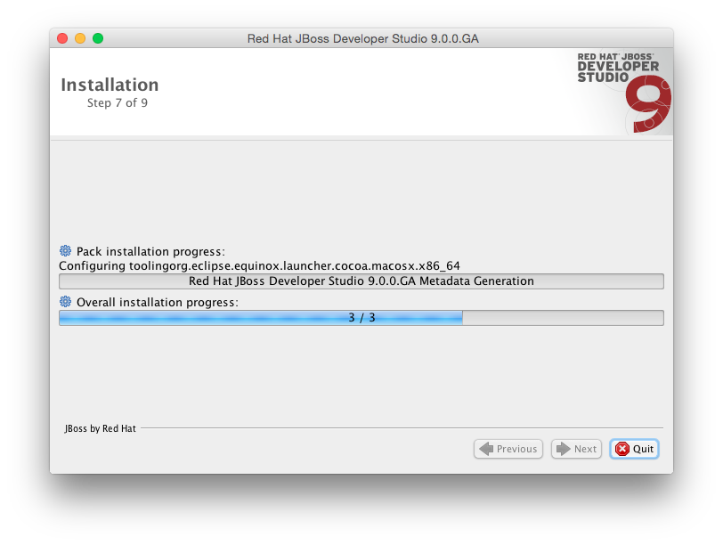
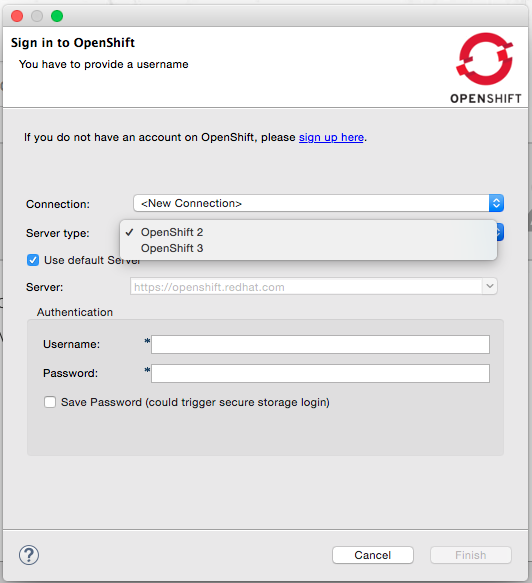
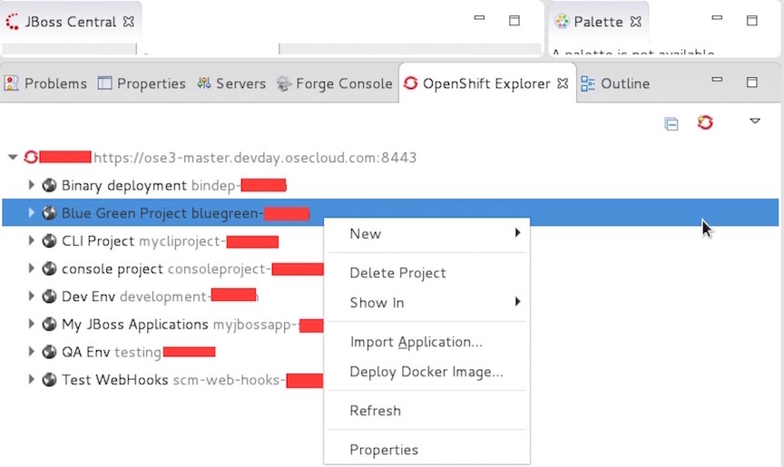
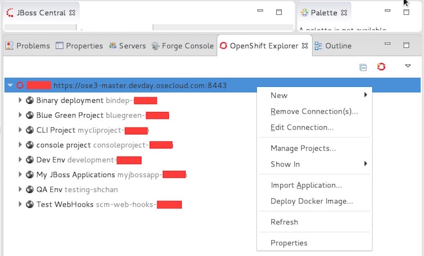
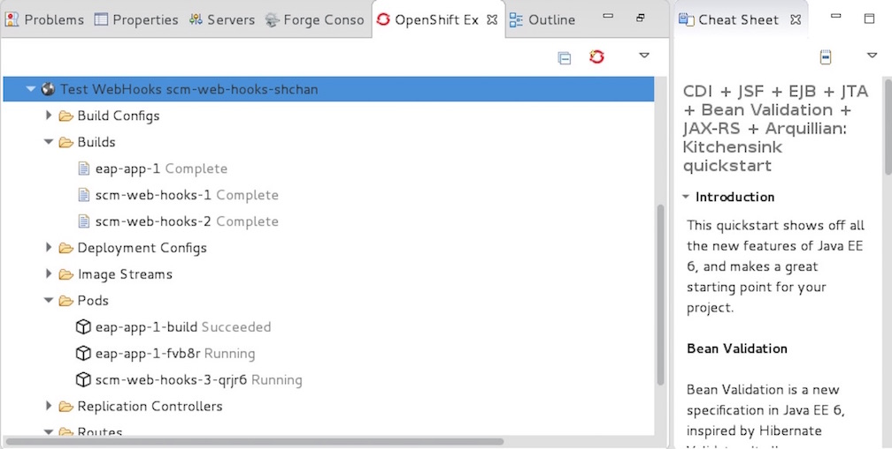
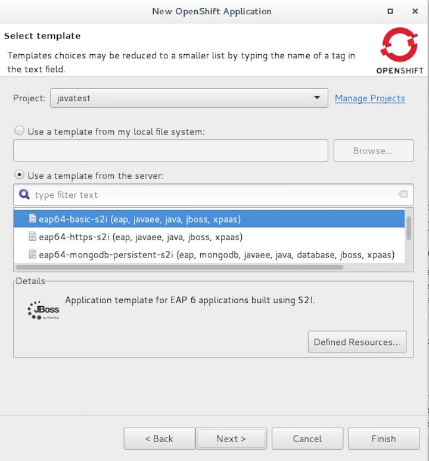
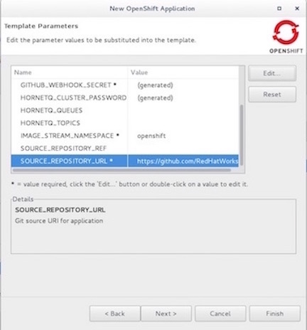

[[installing-the-jboss-developer-studio]]
Installing the JBoss Developer Studio
~~~~~~~~~~~~~~~~~~~~~~~~~~~~~~~~~~~~~

In this exercise we will learn how to install JBDS and configure to
access the OpenShift instance.

*Step 1: Download and install JBoss Studio*

* Download the latest JBoss Developer studio from:
http://www.jboss.org/products/devstudio/download

image:images/jboss_install_2.png[image]

*Step 2: Install OpenShift Plugin*

* Open JBoss Studio.
* Navigate to JBoss Central and select ``Software/Update'' tab
* Look for the OpenShift v3 tools
* Select it and install. Accept license agreement. It may warn you about
unsigned content. Ignore it.

image:images/jboss_install_3.png[image]

image:images/jboss_install_4.png[image]

*Step 3: Configure OpenShift v3 Plugin*

* At the bottom of your IDE, expand the OpenShift explorer panel.
* Add a new connection.
* From the ``Server type'' dropdown box, select OpenShift 3.
* For the Server URL, ensure you add port 8443 if you are not using the
default server FQDN.
* Select the authentication mechanism.
* Provide the username and password.
* Click Finish

*Step 4: Verify your connection*

* At this point, you will be able to see any existing projects for which
the provider username and password have access to.
* You can also see a number of types, such as deployment configurations,
services routes, etc under OpenShift Explorer

*Step 5: Create a OpenShift Application*

* Go to JBoss Studio, right click on the OpenShift connection –> select
New –> select project
* Enter javatest as the new of the project.
* From the JBoss Studio menu, Select File –> New –> OpenShift
Application
* Make sure the information is correct and enter username and password
* Click next.

image:images/jboss_install8.jpg[image]

* Select the newly created project from the project dropdown list
* Select the eap64-basic-s2i template from the list
* Click Next

* Select Parameters listed below and enter the values
** APPLICATION_DOMAIN:mytestapp-javatest-Username.apps.osecloud.com
** APPLICATION_NAME:mytestapp
** CONTEXT_DIR:
** SOURCE_REPOSITORY_REF:
** SOURCE_REPOSITORY_URL: https://github.com/RedHatWorkshops/kitchensink
* Then, click edit to update the values of the parameters.
* Click ok after update each parameter.
* Click Next after updating all the parameters
* Click Finish.

* Click OK

image:images/jboss_install_11.jpg[image]

* Click Finish

image:images/jboss_install_12.jpg[image]

* Review the status under OpenShift Explorer

image:images/jboss_install_13.jpg[image]

link:0_toc.adoc[Table Of Contents]
