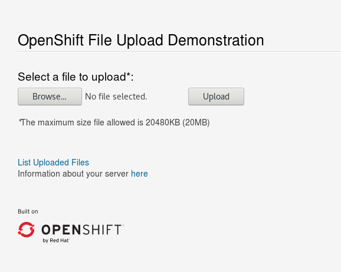
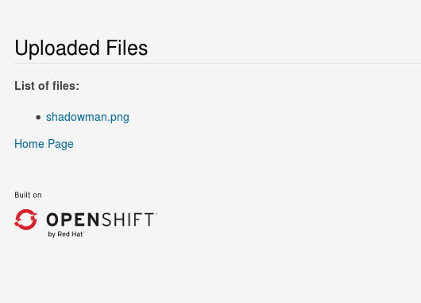
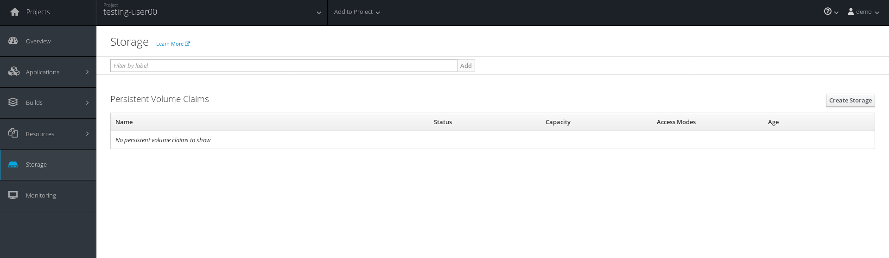
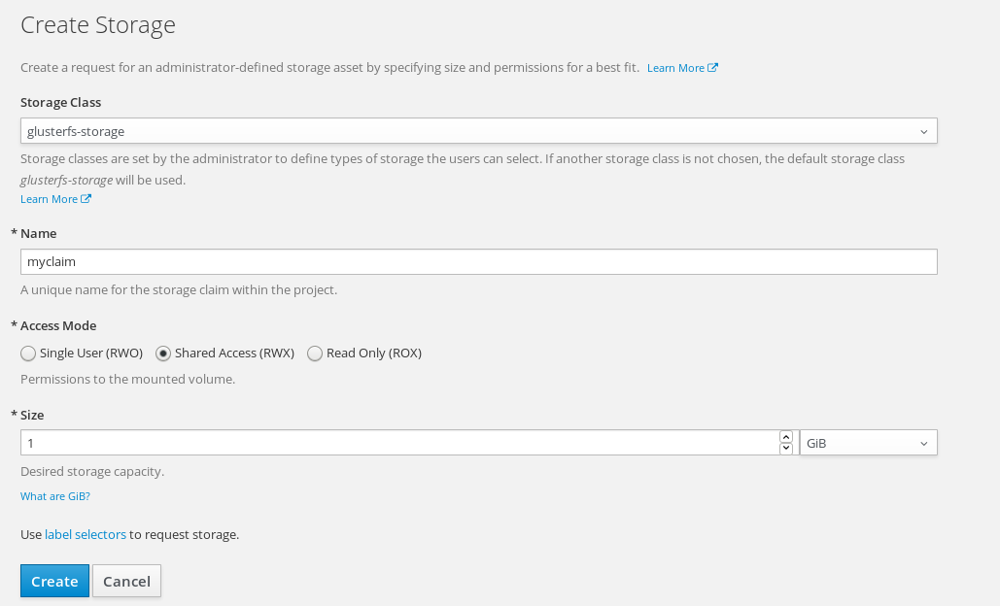

[[using-persistent-storage]]
Using Persistent Storage
~~~~~~~~~~~~~~~~~~~~~~~~

The purpose of this lab is to demonstrate how you can request storage
from OpenShift and have it attach to your application.

Containers, by design, are ephemeral. In short, if you want your application
to store persistent data; you will need to attach to a backend storage system.

In this Lab, we will be:

* Deploying an application that takes uploads
* Upload a File, and delete the pod
* Attach persistant storage
* Upload a File, and delete the pod

*NOTE:* Storage provisioning must be setup by the Operations Team before proceeding.

*Step 1: Deploy Application*

Create a project called `storage-UserName` and deploy the application

....
oc new-project storage-UserName --description="My Storage-project" --display-name="Storage Project"
oc new-app php~https://github.com/RedHatWorkshops/openshift-php-upload-demo
....

Once the application is deployed expose the route
....
$ oc get svc
NAME                        CLUSTER-IP      EXTERNAL-IP   PORT(S)    AGE
openshift-php-upload-demo   172.30.212.62   <none>        8080/TCP   2m

$ oc expose svc openshift-php-upload-demo
route "openshift-php-upload-demo" exposed
....

Visit your application; it should look like this

*Step 2: Test with ephemeral storage*

Pick a file to upload and upload it to the app. Once uploaded you can view
a list of file when you click `List Uploaded Files`. It should look something
like this

You can see where the uploaded files are if you use `oc rsh`. They are uploaded 
under `/opt/app-root/src/uploaded`

....
$ oc get pods
NAME                                READY     STATUS      RESTARTS   AGE
openshift-php-upload-demo-1-build   0/1       Completed   0          10m
openshift-php-upload-demo-1-rdktr   1/1       Running     0          5m

$ oc rsh openshift-php-upload-demo-1-rdktr
sh-4.2$ ls -1 /opt/app-root/src/uploaded
shadowman.png
sh-4.2$ exit
....

Delete this pod.

....
$ oc delete pod openshift-php-upload-demo-1-rdktr
pod "openshift-php-upload-demo-1-rdktr" deleted
....

Now login to your new pod that got spun up. Your data is gone!
....
$ oc get pods
NAME                                READY     STATUS      RESTARTS   AGE
openshift-php-upload-demo-1-build   0/1       Completed   0          13m
openshift-php-upload-demo-1-wnv4r   1/1       Running     0          38s

$ oc rsh openshift-php-upload-demo-1-wnv4r
sh-4.2$  ls -1 /opt/app-root/src/uploaded
sh-4.2$ exit
....

*Step 3: Requesting Storage*

In OpenShift, Storage is abstracted out to where one simply "requests" storage
and it's up to the backend adminsitrator to provide the solution

On the webconsole on the left side navigation click on "Storage". It will bing
you to the storage overview page.

On the right hand side; click the "Create Storage" button. This will take you
to the "Create Storage" page.

Here you need to enter the following

----
* Storage Class: <provided by your instructor>
* Name: myclaim
* Access Mode: Shared Access (RWX)
* Size: 1 GiB
----

The `Storage Class` will be given to you by your instructor. The `Name` must be
unique to the project namespace. The `Access Mode` means "how many apps can access
this storage". For block storage you'd choose `Singe User (RWO)`; in this instance
we are choosing `Shared Access (RWX)` (for File based storage like NFS). The `Size`
is set to `1 GB` just for testing.

Once you click on "Create" it'll go from a `Pending` stage to `Bound`. You can see
this on the command-line as well by checking your `pvc` (Which stands for Persistant
Volume Claim)

....
$ oc get pvc
NAME           STATUS    VOLUME                                     CAPACITY   ACCESSMODES   AGE
myclaim        Bound     pvc-071ee3ef-86d2-11e7-aec4-52540019c877   1Gi        RWX           27s
....

Get yourself familair with the configuration
....
$ oc get pvc myclaim -o yaml
apiVersion: v1
kind: PersistentVolumeClaim
metadata:
  annotations:
    pv.kubernetes.io/bind-completed: "yes"
    pv.kubernetes.io/bound-by-controller: "yes"
    volume.beta.kubernetes.io/storage-class: glusterfs-storage
    volume.beta.kubernetes.io/storage-provisioner: kubernetes.io/glusterfs
  creationTimestamp: 2017-08-22T00:37:07Z
  name: myclaim
  namespace: storage-UserName
  resourceVersion: "48898"
  selfLink: /api/v1/namespaces/testing-user00/persistentvolumeclaims/myclaim
  uid: 071ee3ef-86d2-11e7-aec4-52540019c877
spec:
  accessModes:
  - ReadWriteMany
  resources:
    requests:
      storage: 1Gi
  volumeName: pvc-071ee3ef-86d2-11e7-aec4-52540019c877
status:
  accessModes:
  - ReadWriteMany
  capacity:
    storage: 1Gi
  phase: Bound
....

We will now bind this storage to the application's path of where it is
storing the files. This is under `/opt/app-root/src/uploaded`. You need
to add the volume to the `deploymentConfig` of `openshift-php-upload-demo`.

....
$ oc volume dc/openshift-php-upload-demo  --add -t pvc --claim-name=myclaim --mount-path=/opt/app-root/src/uploaded 
info: Generated volume name: volume-c7jtb
deploymentconfig "openshift-php-upload-demo" updated
....

*Step 3: Testing Configuration*

This will trigger a new deployment. Login to your pod to see the mount.

....
$ oc get pods
NAME                                READY     STATUS      RESTARTS   AGE
openshift-php-upload-demo-1-build   0/1       Completed   0          1h
openshift-php-upload-demo-8-16dzg   1/1       Running     0          1m

$ oc rsh openshift-php-upload-demo-8-16dzg
sh-4.2$ df -h /opt/app-root/src/uploaded/
Filesystem                                        Size  Used Avail Use% Mounted on
172.16.1.11:vol_464dc941ae641d2693b1382cc221a0b5 1016M   33M  983M   4% /opt/app-root/src/uploaded
....

Upload a file like before. Once uploaded; delete the pod

....
$ oc get pods
NAME                                READY     STATUS      RESTARTS   AGE
openshift-php-upload-demo-1-build   0/1       Completed   0          1h
openshift-php-upload-demo-8-16dzg   1/1       Running     0          2m

$ oc delete pod openshift-php-upload-demo-8-16dzg
pod "openshift-php-upload-demo-8-16dzg" deleted
....

Log into the newly spunup pod and verify that your file is still there!

....
$ oc get pods
NAME                                READY     STATUS      RESTARTS   AGE
openshift-php-upload-demo-1-build   0/1       Completed   0          1h
openshift-php-upload-demo-8-4brh0   1/1       Running     0          58s

$ oc rsh openshift-php-upload-demo-8-4brh0
sh-4.2$ ls -1 /opt/app-root/src/uploaded/
shadowman.png
....

[[summary]]
Summary
^^^^^^^

In this lab you learned how to request, attach, and test persistant storage.

link:0_toc.adoc[Table Of Contents]
