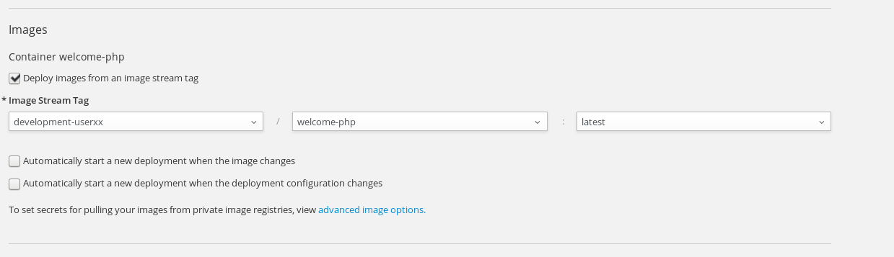
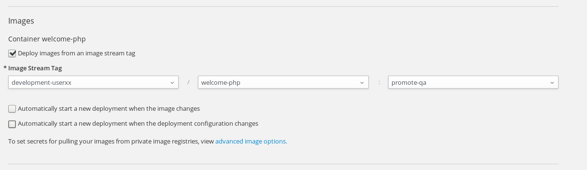
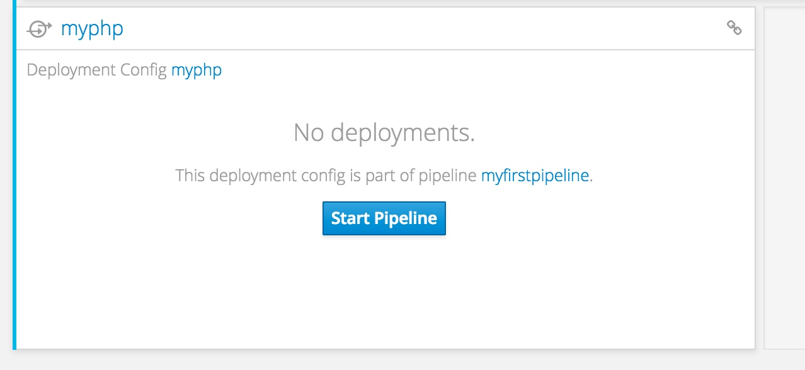

[[creating-a-pipeline]]
Creating a Pipeline
~~~~~~~~~~~~~~~~~~~

In this lab, we will learn to create a build pipeline on OpenShift. This
pipeline will be setup using Jenkins running as an application pod on
OpenShift. The pipeline running on Jenkins will trigger builds and
deployments on OpenShift.

*Prerequisites:*

* You need a github account if you want to make changes and test the pipeline kick-off.
* You will be using the projects you created in the "Promoting Applications" lab.

*Step 1:* Create a new project Create a new project with name
`pipeline-UserName`. _Substitute UserName with your own user name._

*Step 2:* Deploy your CI/CD tool (Jenkins)

Click on `Add to Project` on the Web console, and navigate to
`Import YAML / JSON` tab.

In the text box with heading
`Upload file by dragging & dropping, selecting it, or pasting from the clipboard`,
copy and paste the Build Configuration the following Build Configuration
and press on `Create`.

....
apiVersion: v1
kind: BuildConfig
metadata:
  name: myfirstpipeline
  labels:
    name: myfirstpipeline
  annotations:
    pipeline.alpha.openshift.io/uses: '[{"name": "myphp", "namespace": "", "kind": "DeploymentConfig"}]'
spec:
  triggers:
    -
      type: GitHub
      github:
        secret: secret101
    -
      type: Generic
      generic:
        secret: secret101
  runPolicy: Serial
  source:
    type: None
  strategy:
    type: JenkinsPipeline
    jenkinsPipelineStrategy:
      jenkinsfile: "node() {\nstage 'build'\nopenshiftBuild(buildConfig: 'myphp', showBuildLogs: 'true')\nstage 'deploy'\nopenshiftDeploy(deploymentConfig: 'myphp')\nopenshiftScale(deploymentConfig: 'myphp',replicaCount: '2')\n}"
  output:
  resources:
  postCommit:
....

Note that the build configuration uses `JenkinsPipelineStrategy`. Also
the `spec.strategy.jenkinsPipelineStrategy.jenkinsfile` is the actual
pipeline that runs. We will discuss that in the next step.

This will spin up a Jenkins pod. Give it a few minutes as it takes time
to download and deploy jenkins. You will also see the URL assigned to
your Jenkins. It would be something like
`https://jenkins-pipeline-UserName.apps.workshop.osecloud.com`

If you click on that URL, you will be taken to Jenkins Console. *Note:*
The browser may complain that the URL is insecure. Click on advanced and
proceed to url.

At the next step, choose `Login with OpenShift` and enter your openshift
credentials to login.

On the next screen, allow all `Requested Permissions`

Now you will be taken to Jenkins console (that is running on OpenShift).

*Step 3:* Updating the pipeline

Using left menu on the Web Console, select `Builds`->`Pipelines`. You
will see that `myfirstpipeline` is created. Click on that.

Since we haven’t run the pipeline yet, the `History` tab shows nothing.
If you click on the `Configuration` tab, you will see the build
configuration details.

*Note* There are webhook urls on this page. We will come back to this
and use after a couple of steps.

On the top right hand side click on `Actions` -> `Edit`. This will bring
you to the editing page. Replace the current content with the following.

....
node('maven') {
stage 'buildInDevelopment'
openshiftBuild(namespace: 'development-UserName', buildConfig: 'welcome-php', showBuildLogs: 'true')
stage 'deployInDevelopment'
openshiftDeploy(namespace: 'development-UserName', deploymentConfig: 'welcome-php')
openshiftScale(namespace: 'development-UserName', deploymentConfig: 'welcome-php',replicaCount: '2')
stage 'deployInTesting'
input 'Promote Dev Image to Testing?'
openshiftTag(namespace: 'development-UserName', sourceStream: 'welcome-php',  sourceTag: 'latest', destinationStream: 'welcome-php', destinationTag: 'promote-qa')
openshiftDeploy(namespace: 'testing-UserName', deploymentConfig: 'welcome-php', )
openshiftScale(namespace: 'testing-UserName', deploymentConfig: 'welcome-php',replicaCount: '3')
}
....

And click `Save`. (Make sure you change the values according to your configuration)

Review these `Jenkinsfile` changes on this page.
* It has two stages `build` and `deploy`
* In the build stage the `openshiftBuild` plugin is used to trigger a build named `welcome-php`
* In the deploy stage the `openshiftDeploy` plugin invokes a deployment configuration `welcome-php` and then invokes `openshiftScale` plugin to scale up the same deployment configuration to 2 replicas.

*Step 4:* Permissions and Configuration Changes

The Jenkins user in the jenkins project you created needs
to have access to the projects `development-UserName` and
`testing-UserName`. Just for testing; we will give jenkins
full access to these projects.

....
oc project jenkins-UserName
oc adm policy add-role-to-user admin system:serviceaccount:pipeline-UserName:jenkins -n testing-UserName
oc adm policy add-role-to-user admin system:serviceaccount:pipeline-UserName:jenkins -n development-UserName
....

For reference the syntax is: `system:serviceaccount:PROJECTNAME:SERVICEACCOUNT`

Next, we will edit the `development-UserName` project to disable
the deployment triggers.

Using the left-side navigation; go to `Application` -> `Deployments`. On the overview
page click on your build to see your deployment history page.

Click on the `Actions` -> `Edit` on the upper right hand side to go into
the `Configuration` page for your deployment.

Untick the following boxes:

* `Automatically start a new deployment when the image changes`
* `Automatically start a new deployment when the deployment configuration changes`

Click "Save" and in the end, the config should look like this.

Do the same steps for the `testing-UserName` project. It should
look similar.

*Step 5:* Start pipeline
Change Project to pipeline-Username
Build --> Pipelines
Now click on the `Start Pipeline` button to start the pipeline.

Notice the pipeline starts and `build` and `deploy` stages are executed.

image::images/pipeine3.jpeg[image]

Click on the `View log` link for the pipeline. It’ll take you to Jenkins
and show the logs.

In a couple of minutes, the `build` and `deploy` will complete, and your
application will be deployed and scaled to 2 replicas. Now use the
application to notice that the `blue` box is displayed.

*Step 6:* Configure webhook and trigger with changes (optional)

Navigate back to the `configuration` tab for the pipeline as explained
in Step 3. Copy the value for `Github webhook` url
Since development-User uses git repo from https://github.com/RedHatWorkshops/welcome-php),
you will need to fork this repo and update the development configure to use the forked repo.

Based on what you learn in the past, go to your github repository that
you cloned and set up a webhook pointing to this URL.

*Tips*

* Navigate to `Settings` -> `Webhooks` on your project in github
* Set the `Payload URL` to `Github Webhook` URL noted above
* Make sure the `Content Type` is set to `application/json`
* Press on `Disable SSL`
* Press on `Add Webhook`

Now edit the one of the file in your repo and `Commit` changes.
Pipeline build will be triggered.

Come back and watch the Web Console, you will notice that a new build
has just started. Once the build completes, you will also see the
rolling deployment of the pods.

*Bonus Points*: Watch the videos here
https://blog.openshift.com/create-build-pipelines-openshift-3-3/ and
understand how to create a pipeline that goes across multiple projects.

Congratulations!! In this lab, you have learnt how to set up and run
your own CI/CD pipeline on OpenShift.

link:0_toc.adoc[Table Of Contents]
