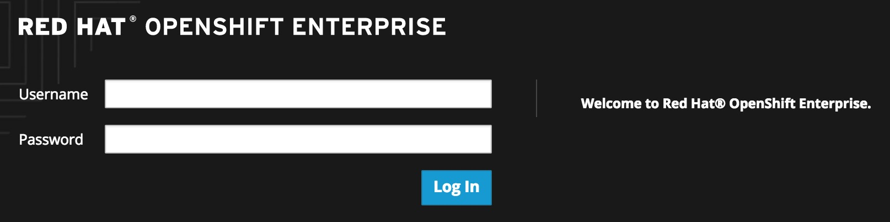
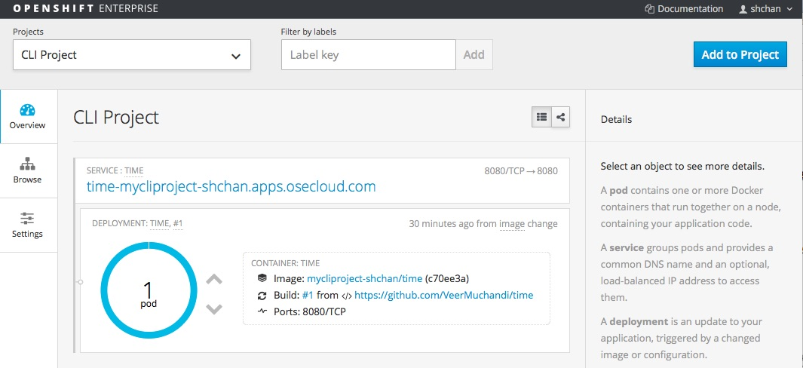
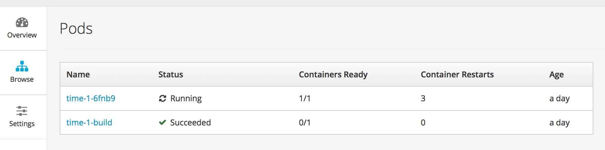

In this lab exercise, we will review the OpenShift Web Console.

Type in the master public URL provided by your instructor in a browser. Use <master public URL>:8443. You will be directed to an OpenShift login page. 

**Note**: Your browser may complain about the server's security certificates not trusted by your computer. You can agree to proceed to the master URL.

Key in the username and password provided by the instructor. You will see the list of projects now. Note the project you created in the last lab exercise is shown here.

Also note the `Create...` button which allows you to create a new project from Web Console.
x
Now click on the CLI Project to view the details. OpenShift takes you by default to the `Overview` page and shows you a graphic representation of the application that is deployed here. You can see that a single pod is running and is frontended by a service. Note the route that you configured for this service is also shown.
You will also see the `Add to Project` button on the right top. This can be used to create new application from Web Console inside this project. 

Click  to go to the topology view.

Click onto each component (services, pod, route, etc...) to get the details of each component.

Click on `Browse` tab on the left and go through the list of items you can view there.  

* Select `Builds` under `Browse` tab, you will see all the build configurations. Click onto each build configuration, we will be able to view all the build details.

* Select `Pods` under `Browse` tab, you will find a running pod that is running your application image. Note that it also tells you the node on which the pod is running and other details about this pod. You will also see the build pod that had succeeded. 

Click onto running pod, it shows the details on the pod. In addition, metrics, logs and terminal also available for monitoring.

Click on terminal tab, you will be able to access the pod from web console.

If you click onto the Metrics tab under Pod and get an error viewing metrics on the broswer, please do the following:

* open https://hawkular.apps.osecloud.com/hawkular/metrics from a new tab on the same broswer
* click "Advanced" link 
* click "Proceed to hawkular.apps.osecloud.com (unsafe)"
* refresh the broswer where you login at Openshift console.

Note there are webhook URLs. We will use them in a later lab exercise. You can start a build from the Web Console by pressing the `Build` button. It also gives you a command to start the build from CLI.

* Select `Services` under `Browse` tab, you will find the service created for your application. Click onto one of the services, it shows all the details about the service along with the route exposed by this service.

* Select `Routes` under `Browse` tab, you will see all the routes in the projects. Click onto a route, it shows all the details for this route.

* Select `Deployment` under `Browse` tab, you will see all the deployments. Click onto a deployment, it shows all the details of the deployment. By pressing the `Deploy` button, you will be able to start a deployment from the web console.

* Select `Event` under `Browse` tab, you will see all the events for the project.

* Select `Image Streams` under `Browse` tab, it shows the list of image streams for the project. Click onto the specific image stream, it shows more details about the image stream.

Click on the `Settings` tab on the left to see that it would display the Quotas and Resource Limits, if they exist. We will deal with them in a different lab exercise.

Spend a few minutes and familiarize using Web Console.

