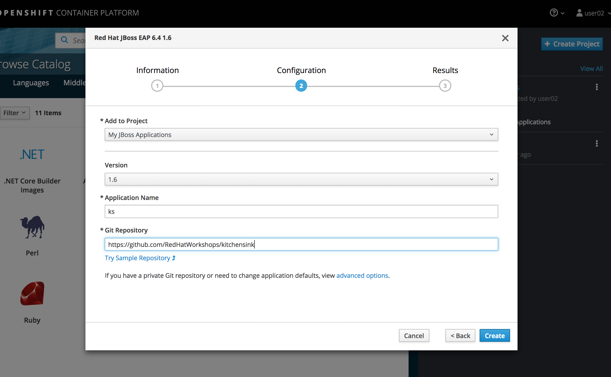
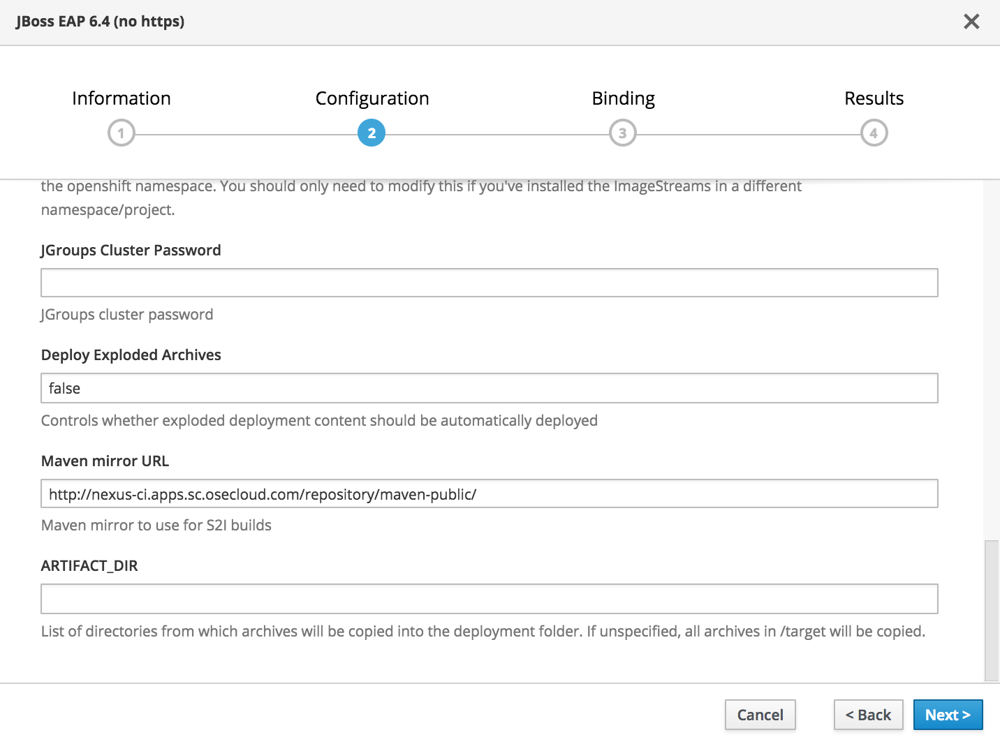
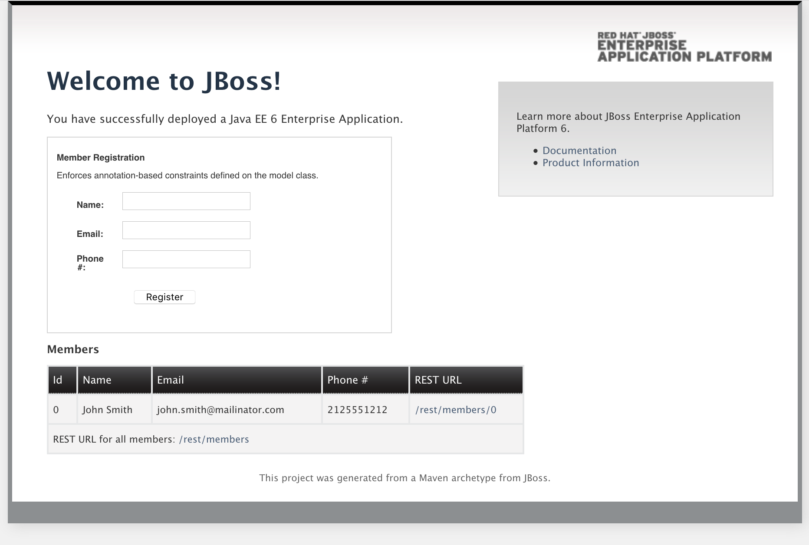

[[creating-an-application-using-jboss-eap-builder-image]]
Creating an application using JBoss EAP builder image
~~~~~~~~~~~~~~~~~~~~~~~~~~~~~~~~~~~~~~~~~~~~~~~~~~~~~

In this exercise we will learn how to create an application using source
code and the JBoss EAP builder image.

*Step 1: Create a project or use an existing project*

If you want to, you can create a new project based on what you have
learned in previous labs. Or you can create a new project for JBoss
Applications.

*Remember* to replace the username before running the command.

....
$ oc new-project myjbossapp-UserName --display-name="My JBoss Applications" --description="A place for my JBoss EAP Applications"
....

*Step 2: Create an application that uses the JBoss EAP builder image*

We will be using a sample application called `Kitchensink` (found
https://github.com/RedHatWorkshops/kitchensink[here]). Taking that
source-code; we will use the JBoss ImageStream (or the builder image) to
assemble our application.

Open the browser and select your new project *My JBoss Applications*.

Click into *Browse Catalog* button.

In the search text box type `EAP 6.4` and select `JBoss EAP 6.4 (no https)`.

Click Next

....
In the Add to Project box select the created "My JBoss Applications" Project
Add to Project: select your project name if it is not show

Application Name: ks

Git Repository URL: https://github.com/RedHatWorkshops/kitchensink

Git Reference: master

Context Directory: /

Maven mirror URL: {{NEXUS_URL}}
....

*REMEMBER:* Check with your instructor the proper URL for the Nexus
repository.

Click Next
Select `Create a secret in ... to be used later`
Click on *Create* and then on *Continue to the project overview*.

*Step 3: Build*

Give it some seconds and you will see OpenShift starts the build process
for you. You can view the list of builds using `oc get builds` command.

....
$ oc get builds

NAME      TYPE      FROM          STATUS     STARTED         DURATION
ks-1      Source    Git@50ea6f4   Complete   2 minutes ago   24s
....

Note the name of the build that is running i.e. `ks-1`. We will use that
name to look at the build logs. Run the command as shown below to look
at the build logs. This will run for a few mins. At the end you will
notice that the docker image is successfully created and it will start
pushing this to OpenShift’s internal docker registry.

....
$oc get pods
NAME         READY     STATUS    RESTARTS   AGE
ks-1-build   1/1       Running   0          11m
....

We can check the logs by executing the following command:

....
$ oc logs pod/ks-1-build

[INFO]
[INFO] ------------------------------------------------------------------------
[INFO] Building JBoss AS Quickstarts: kitchensink 7.1.1-SNAPSHOT
[INFO] ------------------------------------------------------------------------

[INFO] Packaging webapp
[INFO] Assembling webapp [jboss-kitchensink] in [/home/jboss/source/target/jboss-kitchensink]
[INFO] Processing war project
[INFO] Copying webapp resources [/home/jboss/source/src/main/webapp]
[INFO] Webapp assembled in [24 msecs]
[INFO] Building war: /home/jboss/source/deployments/ROOT.war
[INFO] ------------------------------------------------------------------------
[INFO] BUILD SUCCESS
[INFO] ------------------------------------------------------------------------
[INFO] Total time: 7.123s
[INFO] Finished at: Thu Oct 06 02:15:38 EDT 2016
[INFO] Final Memory: 19M/129M
[INFO] ------------------------------------------------------------------------
Copying all war artifacts from /home/jboss/source/target directory into /opt/eap/standalone/deployments for later deployment...
Copying all ear artifacts from /home/jboss/source/target directory into /opt/eap/standalone/deployments for later deployment...
Copying all rar artifacts from /home/jboss/source/target directory into /opt/eap/standalone/deployments for later deployment...
Copying all jar artifacts from /home/jboss/source/target directory into /opt/eap/standalone/deployments for later deployment...
Copying all war artifacts from /home/jboss/source/deployments directory into /opt/eap/standalone/deployments for later deployment...
'/home/jboss/source/deployments/ROOT.war' -> '/opt/eap/standalone/deployments/ROOT.war'
Copying all ear artifacts from /home/jboss/source/deployments directory into /opt/eap/standalone/deployments for later deployment...
Copying all rar artifacts from /home/jboss/source/deployments directory into /opt/eap/standalone/deployments for later deployment...
Copying all jar artifacts from /home/jboss/source/deployments directory into /opt/eap/standalone/deployments for later deployment...

Pushing image 172.30.89.28:5000/myjbossapp-admin/ks:latest ...
Pushed 0/6 layers, 2% complete
Pushed 1/6 layers, 22% complete
Pushed 2/6 layers, 47% complete
Pushed 3/6 layers, 73% complete
Pushed 4/6 layers, 82% complete
Pushed 5/6 layers, 98% complete
Pushed 6/6 layers, 100% complete
Push successful
....

You will notice that in the logs that not only does it copy your source
code to the builder image, but it also does a `maven` build to compile
your code as well. Also, in the above log, note how the image is pushed
to the local docker registry. The registry is running at `docker-registry.default.svc`
at port `5000`.

*Step 4: Deployment*

Once the image is pushed to the docker registry, OpenShift will trigger
a deploy process. Let us also quickly look at the deployment
configuration by running the following command. Note `dc` represents
`deploymentconfig`.

....
$ oc get dc ks -o json

{
    "kind": "DeploymentConfig",
    "apiVersion": "v1",
    "metadata": {
        "name": "ks",
        "namespace": "myjbossapp-admin",
        "selfLink": "/oapi/v1/namespaces/myjbossapp-admin/deploymentconfigs/ks",
        "uid": "eb474e40-8b8a-11e6-ba5b-080027782cf7",
        "resourceVersion": "32872",
        "generation": 2,
        "creationTimestamp": "2016-10-06T06:05:45Z",
        "labels": {
            "app": "ks"
        },
        "annotations": {
            "openshift.io/generated-by": "OpenShiftNewApp"
        }
    },
    "spec": {
        "strategy": {
            "type": "Rolling",
            "rollingParams": {
                "updatePeriodSeconds": 1,
                "intervalSeconds": 1,
                "timeoutSeconds": 600,
                "maxUnavailable": "25%",
                "maxSurge": "25%"
            },
            "resources": {}
        },
        "triggers": [
            {
                "type": "ConfigChange"
            },
            {
                "type": "ImageChange",
                "imageChangeParams": {
                    "automatic": true,
                    "containerNames": [
                        "ks"
                    ],
                    "from": {
                        "kind": "ImageStreamTag",
                        "namespace": "myjbossapp-admin",
                        "name": "ks:latest"
                    },
                    "lastTriggeredImage": "172.30.89.28:5000/myjbossapp-admin/ks@sha256:156db8530725a535f9b7ab7b696fab2e3c9c27c7fa0db0ea91bec87ed52b4193"
                }
            }
        ],
        "replicas": 1,
        "test": false,
        "selector": {
            "app": "ks",
            "deploymentconfig": "ks"
        },
        "template": {
            "metadata": {
                "creationTimestamp": null,
                "labels": {
                    "app": "ks",
                    "deploymentconfig": "ks"
                },
                "annotations": {
                    "openshift.io/container.ks.image.entrypoint": "[\"/opt/eap/bin/openshift-launch.sh\"]",
                    "openshift.io/generated-by": "OpenShiftNewApp"
                }
            },
            "spec": {
                "containers": [
                    {
                        "name": "ks",
                        "image": "172.30.89.28:5000/myjbossapp-admin/ks@sha256:156db8530725a535f9b7ab7b696fab2e3c9c27c7fa0db0ea91bec87ed52b4193",
                        "ports": [
                            {
                                "containerPort": 8080,
                                "protocol": "TCP"
                            },
                            {
                                "containerPort": 8443,
                                "protocol": "TCP"
                            },
                            {
                                "containerPort": 8778,
                                "protocol": "TCP"
                            }
                        ],
                        "resources": {},
                        "terminationMessagePath": "/dev/termination-log",
                        "imagePullPolicy": "Always"
                    }
                ],
                "restartPolicy": "Always",
                "terminationGracePeriodSeconds": 30,
                "dnsPolicy": "ClusterFirst",
                "securityContext": {}
            }
        }
    },
    "status": {
        "latestVersion": 1,
        "observedGeneration": 2,
        "replicas": 1,
        "updatedReplicas": 1,
        "availableReplicas": 1,
        "details": {
            "message": "caused by an image change",
            "causes": [
                {
                    "type": "ImageChange",
                    "imageTrigger": {
                        "from": {
                            "kind": "ImageStreamTag",
                            "namespace": "myjbossapp-admin",
                            "name": "ks:latest"
                        }
                    }
                }
            ]
        }
    }
}
....

Note where the image is picked from. It shows that the deployment picks
the image from the local registry (same ip address and port as in
buildconfig) and the image tag is the same as what we built earlier.
This means the deployment step deploys the application image what was
built earlier during the build step.

If you get the list of pods, you’ll notice that the application gets
deployed quickly and starts running in its own pod.

....
$ oc get pods

NAME         READY     STATUS      RESTARTS   AGE
ks-1-build   0/1       Completed   0          26m
ks-1-ey7m2   1/1       Running     0          12m
....

*Step 5: Adding route*

This step is very much the same as what we did in previous exercises. We
will check the service and add a route to expose that service.

....
$ oc get service ks

NAME      CLUSTER-IP      EXTERNAL-IP   PORT(S)                      AGE
ks        172.30.201.90   <none>        8080/TCP,8443/TCP,8778/TCP   21m
....

Route should be already created.

....
$ oc get routes

NAME      HOST/PORT                                                      PATH      SERVICES   PORT       TERMINATION
ks        ks-myjbossapp-Username.apps.workshop.osecloud.com                                 ks         8080-tcp
....

If route does not show, we expose the service `ks` via the command
below.

....
$ oc expose service ks

route "ks" exposed
....

And now we can check the route uri.

*Step 6: Run the application*

Now access the application by using the route you got in the previous
step. You can use either curl or your browser.

....
$ curl ks-myjbossapp-UserName.apps.workshop.osecloud.com

<!--
    JBoss, Home of Professional Open Source
    Copyright 2014, Red Hat, Inc. and/or its affiliates, and individual
    contributors by the @authors tag. See the copyright.txt in the
    distribution for a full listing of individual contributors.

    Licensed under the Apache License, Version 2.0 (the "License");
    you may not use this file except in compliance with the License.
    You may obtain a copy of the License at
    http://www.apache.org/licenses/LICENSE-2.0
    Unless required by applicable law or agreed to in writing, software
    distributed under the License is distributed on an "AS IS" BASIS,
    WITHOUT WARRANTIES OR CONDITIONS OF ANY KIND, either express or implied.
    See the License for the specific language governing permissions and
    limitations under the License.
-->
<!-- Plain HTML page that kicks us into the app -->

<html>
<head>
<meta http-equiv="Refresh" content="0; URL=index.jsf">
</head>
</html>
....

Go to https://ks-myjbossapp-Username.apps.workshop.osecloud.com via your browser.
Please replace your username with yours.

Congratulations! In this exercise you have learned how to create, build
and deploy a JBoss EAP application using OpenShift’s JBoss EAP Builder
Image.

link:0_toc.adoc[Table Of Contents]
