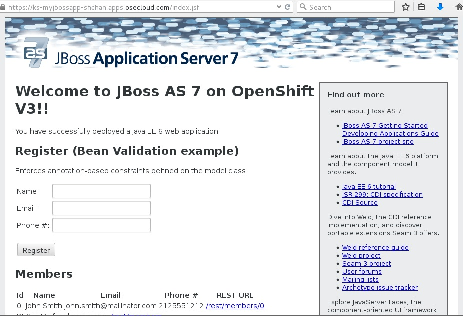

In this exercise we will learn how to create a JBoss EAP using source code and the JBoss EAP builder image.

**Step 1: Create a project or use an existing project**

If you want to, you can create a new project based on what you have learned in previous labs. Or you can create a new project for JBoss Applications.

**Remember** to replace the username before running the command.

````
$ oc new-project myjbossapp-UserName --display-name="My JBoss Applications" --description="A place for my JBoss EAP Applications"
````

**Step 2: Create an application that uses the JBoss EAP builder image**

We will be using a sample application called "Kitchensink" (found [here](https://github.com/RedHatWorkshops/kitchensink) ). Taking that source-code; we will use the JBoss ImageStream (or the builder image) to assemble our application. 

Now create an application using the sample source-code found here https://github.com/RedHatWorkshops/kitchensink. Run the `oc new-app` command by supplying the git uri as the parameter.

Be aware that you can list all the image streams by running:

```
oc get is -n openshift
```

```
$ oc new-app jboss-eap64-openshift~https://github.com/RedHatWorkshops/kitchensink --name=ks
--> Found image c12d6b0 (11 weeks old) in image stream "jboss-eap64-openshift in project openshift" under tag :latest for "jboss-eap64-openshift"
    * A source build using source code from https://github.com/RedHatWorkshops/kitchensink will be created
      * The resulting image will be pushed to image stream "ks:latest"
    * This image will be deployed in deployment config "ks"
    * Ports 8080/tcp, 8443/tcp will be load balanced by service "ks"
--> Creating resources with label app=ks ...
    ImageStream "ks" created
    BuildConfig "ks" created
    DeploymentConfig "ks" created
    Service "ks" created
--> Success
    Build scheduled for "ks" - use the logs command to track its progress.
    Run 'oc status' to view your app.
```


**Step 3: Build**

Give it some time and you will see OpenShift starts the build process for you. You can view the list of builds using `oc get builds` command.

```
$ oc get builds
NAME      TYPE      STATUS    POD
ks-1      Source    Running   ks-1-build
```

Note the name of the build that is running i.e. ks-1. We will use that name to look at the build logs. Run the command as shown below to look at the build logs. This will run for a few mins. At the end you will notice that the docker image is successfully created and it will start pushing this to OpenShift's internal docker registry.


```
$oc get pods
NAME         READY     STATUS    RESTARTS   AGE
ks-1-build   1/1       Running   0          11m

$ oc logs pod/ks-1-build

....
....
[INFO]
[INFO] ------------------------------------------------------------------------
[INFO] Building JBoss AS Quickstarts: kitchensink 7.1.1-SNAPSHOT
[INFO] ------------------------------------------------------------------------

[INFO] Packaging webapp
[INFO] Assembling webapp [jboss-as-kitchensink] in [/home/jboss/source/target/jboss-as-kitchensink]
[INFO] Processing war project
[INFO] Copying webapp resources [/home/jboss/source/src/main/webapp]
[INFO] Webapp assembled in [49 msecs]
[INFO] Building war: /home/jboss/source/deployments/ROOT.war
[INFO] ------------------------------------------------------------------------
[INFO] BUILD SUCCESS
[INFO] ------------------------------------------------------------------------
[INFO] Total time: 44.374s
[INFO] Finished at: Mon Dec 21 22:39:34 EST 2015
[INFO] Final Memory: 20M/157M
[INFO] ------------------------------------------------------------------------
Copying all target war ear jar artifacts from /home/jboss/source/target directory into /opt/eap/standalone/deployments for later deployment...
Copying all deployments war ear jar artifacts from /home/jboss/source/deployments directory into /opt/eap/standalone/deployments for later deployment...
'/home/jboss/source/deployments/ROOT.war' -> '/opt/eap/standalone/deployments/ROOT.war'
I1221 22:40:02.197921       1 sti.go:213] Using provided push secret for pushing 172.30.47.239:5000/myjbossapp-shchan/ks:latest image
I1221 22:40:02.198384       1 sti.go:217] Pushing 172.30.47.239:5000/myjbossapp-shchan/ks:latest image ...
I1221 22:42:07.773732       1 sti.go:233] Successfully pushed 172.30.47.239:5000/myjbossapp-shchan/ks:latest

```
You will notice that in the logs that not only does it copy your source code to the builder image, but it also does a `maven` build to compile your code as well. Also, in the above log, note how the image is pushed to the local docker registry. The registry is running at 172.30.47.239 at port 5000.

***Step 4: Deployment***

Once the image is pushed to the docker registry, OpenShift will trigger a deploy process. Let us also quickly look at the deployment configuration by running the following command. Note dc represents deploymentconfig.

```
$ oc get dc ks -o json
{
    "kind": "DeploymentConfig",
    "apiVersion": "v1",
    "metadata": {
        "name": "ks",
        "namespace": "myjbossapp-shchan",
        "selfLink": "/oapi/v1/namespaces/myjbossapp-shchan/deploymentconfigs/ks",
        "uid": "ec6bbae2-a85b-11e5-be21-fa163ec58dad",
        "resourceVersion": "2902079",
        "creationTimestamp": "2015-12-22T03:27:26Z",
        "labels": {
            "app": "ks"
        },
        "annotations": {
            "openshift.io/generated-by": "OpenShiftNewApp"
        }
    },
    "spec": {
        "strategy": {
            "type": "Rolling",
            "rollingParams": {
                "updatePeriodSeconds": 1,
                "intervalSeconds": 1,
                "timeoutSeconds": 600,
                "maxUnavailable": "25%",
                "maxSurge": "25%"
            },
            "resources": {}
        },
        "triggers": [
            {
                "type": "ConfigChange"
            },
            {
                "type": "ImageChange",
                "imageChangeParams": {
                    "automatic": true,
                    "containerNames": [
                        "ks"
                    ],
                    "from": {
                        "kind": "ImageStreamTag",
                        "name": "ks:latest"
                    },
                    "lastTriggeredImage": "172.30.47.239:5000/myjbossapp-shchan/ks@sha256:1f31fa5e345951b517264fe7695eb82fea0ad717562b1c30f82eaba64d6683d0"
                }
            }
        ],
        "replicas": 1,
        "selector": {
            "app": "ks",
            "deploymentconfig": "ks"
        },
        "template": {
            "metadata": {
                "creationTimestamp": null,
                "labels": {
                    "app": "ks",
                    "deploymentconfig": "ks"
                },
                "annotations": {
                    "openshift.io/generated-by": "OpenShiftNewApp"
                }
            },
            "spec": {
                "containers": [
                    {
                        "name": "ks",
                        "image": "172.30.47.239:5000/myjbossapp-shchan/ks@sha256:1f31fa5e345951b517264fe7695eb82fea0ad717562b1c30f82eaba64d6683d0",
                        "ports": [
                            {
                                "containerPort": 8080,
                                "protocol": "TCP"
                            },
                            {
                                "containerPort": 8443,
                                "protocol": "TCP"
                            }
                        ],
                        "resources": {},
                        "terminationMessagePath": "/dev/termination-log",
                        "imagePullPolicy": "Always"
                    }
                ],
                "restartPolicy": "Always",
                "terminationGracePeriodSeconds": 30,
                "dnsPolicy": "ClusterFirst",
                "securityContext": {}
            }
        }
    },
    "status": {
        "latestVersion": 1,
        "details": {
            "causes": [
                {
                    "type": "ImageChange",
                    "imageTrigger": {
                        "from": {
                            "kind": "DockerImage",
                            "name": "172.30.47.239:5000/myjbossapp-shchan/ks:latest"
                        }
                    }
                }
            ]
        }
    }
}

```
Note where the image is picked from. It shows that the deployment picks the image from the local registry (same ipaddress and port as in buildconfig) and the image tag is the same as what we built earlier. This means the deployment step deploys the application image what was built earlier during the build step.

If you get the list of pods, you'll notice that the application gets deployed quickly and starts running in its own pod.

```
$ oc get pods
NAME         READY     STATUS      RESTARTS   AGE
ks-1-build   0/1       Completed   0          26m
ks-1-ey7m2   1/1       Running     0          12m
```

**Step 5: Adding route**

This step is very much the same as what we did in previous exercises. We will check the service and add a route to expose that service. 

```
$ oc get service ks
NAME      CLUSTER_IP     EXTERNAL_IP   PORT(S)             SELECTOR                     AGE
ks        172.30.139.2   <none>        8080/TCP,8443/TCP   app=ks,deploymentconfig=ks   27m
```

```
$ oc expose service ks
route "ks" exposed
```

```
$ oc get routes
NAME  HOST/PORT                                PATH  SERVICE   LABELS    INSECURE POLICY   TLS TERMINATION
ks    ks-myjbossapp-Username.apps.osecloud.com   ks    app=ks        
```

**Step 6: Run the application**

Now run the application by using the route you provided in the previous step. You can use either curl or your browser.

````

$ curl ks-myjbossapp-UserName.apps.osecloud.com

 <!-- Plain HTML page that kicks us into the app -->
<html>
<head>
<meta http-equiv="Refresh" content="0; URL=index.jsf">
</head>
</html>
````
Go to https://ks-myjbossapp-Username.apps.osecloud.com via your browser. Please replace your username with yours.



Congratulations! In this exercise you have learned how to create, build and deploy a JBoss EAP application using OpenShift's JBoss EAP Builder Image.


