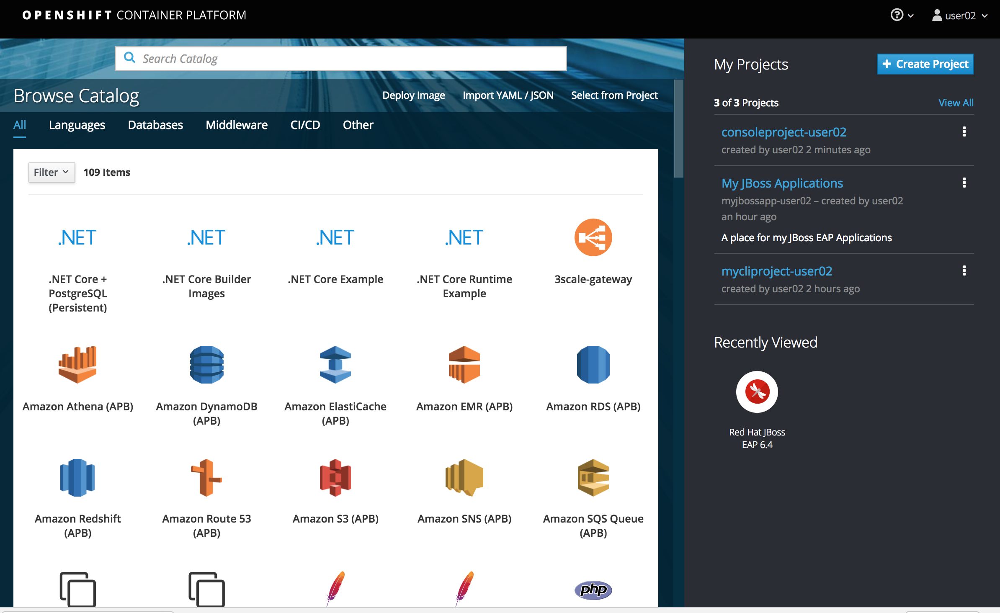
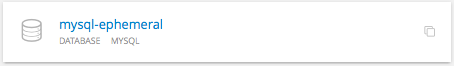
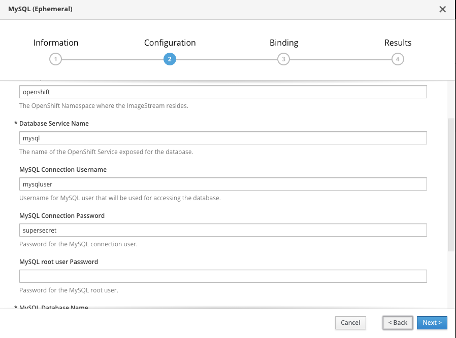
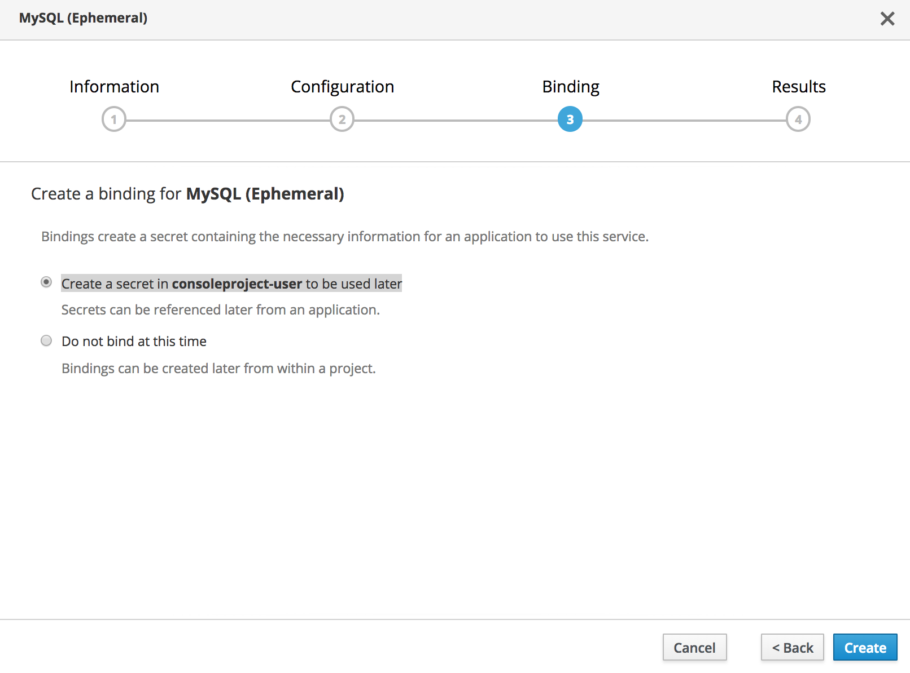
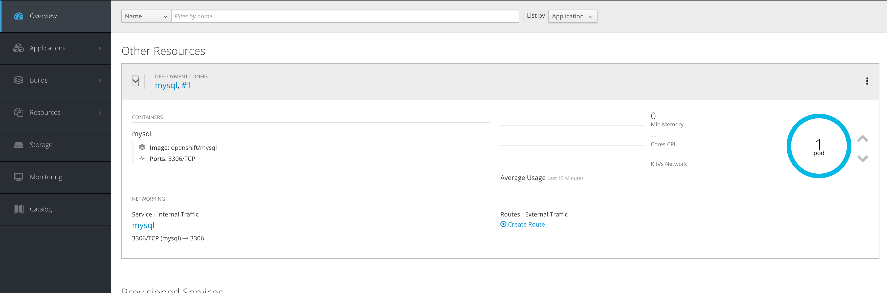
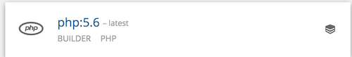
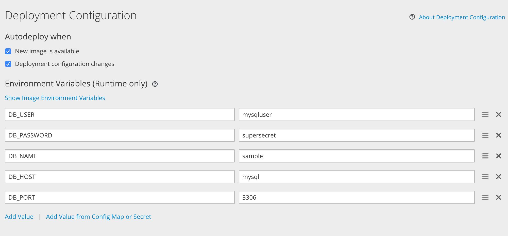
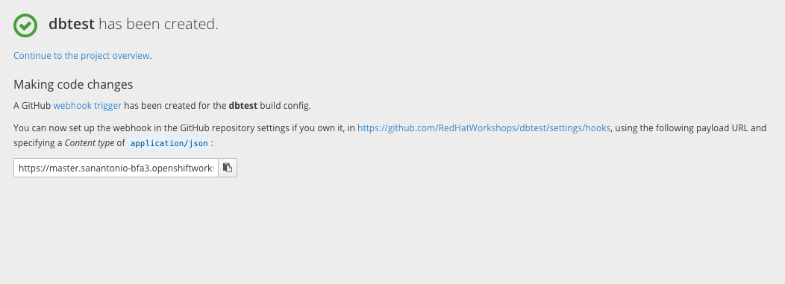
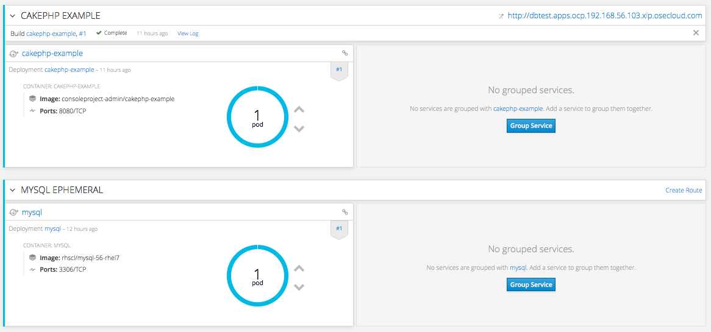
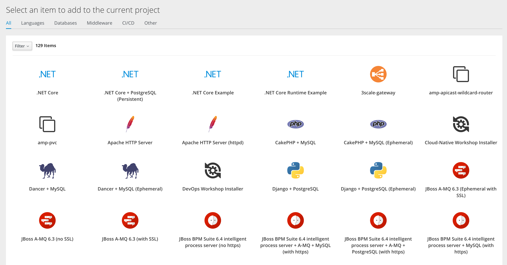

[[using-templates]]
Using Templates
~~~~~~~~~~~~~~~

In this lab exercise we will learn how to use OpenShift Web Console to
spin up a MySQL database using templates. We will then add a frontend
PHP application that accesses this database using the service exposed by
the database. We will provide a route (a URL) to access the frontend
application from a browser.

*Step 1: Create a Project*

Based on the experience gained from the previous exercise, log into the
OpenShift Web Console. You will see the list of Projects.

Using the *Create Project* button, create a new project. We will call it
*consoleproject-UserName*. Replace by your username to make this project
unique. Type in a *Display Name* and *Description* of your choice.

Press the *Create* button to complete the project creation from the Web
Console. This will accomplish the same job as `oc new-project` from CLI.

*Step 2: Create a MYSQL database using the template*

Click on *Add to Project -> Browse Catolog* button and you will be taken to select an
image or template. You will see the application create screen as shown
below:

Click on *Databases* tab. Find *MySQL* then *MySQL (Ephemeral)*
template from the list and click *Select*. You will also notice *MySQL
(Persistent)* template. But we will address that in a different lab
exercise.

You will be taken to the mysql ephemeral creation screen. Click *Next*
parameters and edit the values to use the following values:

....
Add to Project: consoleproject-UserName
Database Service Name: mysql
MySQL Connection Username: pricelist
MySQL Connection Password: pricelist
MySQL root user Password: pricelist
MySQL Database Name: pricelist
....

Click the *Next* button.

Click the checkbox to create the secret

Click *Create*

Click *Continue to project overview*.

It will take you back to the project overview page and soon you will see
an image of a running pod.

Please wait for the Bindings to complete. It may take few minutes.

While we are waiting we can add a lable to the mysql deployment
Run the following on the command line:
****
 oc label dc mysql app=pricelist
****

*Step 3: Add a PHP frontend to talk to this database*

In this step we will add a PHP frontend application that talks to
recently created database. The code is available on github at

https://github.com/RedHatWorkshops/php-pricelist

Browse through the code in this repository. If you take a look at the
link:https://raw.githubusercontent.com/RedHatWorkshops/php-pricelist/master/config/database.php[database configuration] file (`config/database.php`) you will see that
it reads the values from environment varables.

To add a frontend again click on *Add to Project -> Browse Catalog*
This will take you to the Service Catalog.
Select Languages -> PHP -> PHP

Click *Next*

****
Add to Project: consoleproject-UserName (this should be the same project as MySQL Ephemeral)
Application Name: pricelist
Git Repository: https://github.com/RedHatWorkshops/php-pricelist

Click onto the link `Advanced Options`
Go to Deployment Configuration section and enter the
following environment variables:

In the Labels section add the following label if its not there:

....
* app=pricelist
....

Click *Create* to add this frontend application to talk to the database.

Click *Continue to product overview*.

You will be taken back to the Project Overview page and you will start
seeing that a new service is now available and exposed as a route. Since
you labeled both frontend web and backend db as `app=pricelist` it will
show as one application

You will also notice that a build starts running very soon. Once the
build completes, the application image created from the source code will
be uploaded to the docker repository.

You can check the build logs using the following command:

....
$ oc logs build/pricelist-1
Cloning "https://github.com/RedHatWorkshops/php-pricelist" ...
	Commit:	2aa50442e8432c48beedc1503cd3d05dcb834515 (Added db connection)
	Author:	Christian Hernandez <christian.hernandez@yahoo.com>
	Date:	Thu Jun 29 10:52:43 2017 -0700
---> Installing application source...
Pushing image docker-registry.default.svc:5000/consoleproject-christian/pricelist:latest ...
Pushed 0/6 layers, 2% complete
Pushed 1/6 layers, 26% complete
Pushed 2/6 layers, 42% complete
Pushed 3/6 layers, 56% complete
Pushed 4/6 layers, 75% complete
Pushed 5/6 layers, 97% complete
Pushed 6/6 layers, 100% complete
Push successful
....

Once the build completes, OpenShift initiates a deploy process. Once the
deployment is complete, the frontend pod starts running. You will find
the running pod when you navigate to *Applications->Pods* on the Web
console.

Now use `curl` to run the database `bootstrap` script
....
$ oc project
Using project "consoleproject-Username" on server "{{CONSOLE_ADDRESS}}".

$ curl -k http://$(oc get route/pricelist -o jsonpath='{.spec.host}')/create_database.php
Array
(
    [0] => 00000
    [1] =>
    [2] =>
)

....

Go ahead and open your application. The URL will be displayed by `oc get route`

....
$ oc get route
NAME        HOST/PORT                                                    PATH      SERVICES    PORT       TERMINATION   WILDCARD
pricelist   pricelist-consoleproject-Username.apps.workshop.osecloud.com 	                   pricelist   8080-tcp                 None
....

When you open your application, click on the "Create Record" button and create a record.
Once you added a record, click on "Read Records". The page should look
like this.

You can verify this by logging into the database using `oc rsh`

....
$ oc get pods
NAME                READY     STATUS      RESTARTS   AGE
mysql-1-rxnlp       1/1       Running     0          25m
pricelist-1-build   0/1       Completed   0          13m
pricelist-1-z55t2   1/1       Running     0          12m
....

Here you'll notice that the database pod is called `mysql-1-rxnlp`. Login
to this pod using `oc rsh`

....
$ oc rsh mysql-1-rxnlp
sh-4.2$
....

Run `mysql -u root pricelist` to login and run the query.
....
sh-4.2$ mysql -u root pricelist
Welcome to the MySQL monitor.  Commands end with ; or \g.
Your MySQL connection id is 326
Server version: 5.7.16 MySQL Community Server (GPL)

Copyright (c) 2000, 2016, Oracle and/or its affiliates. All rights reserved.

Oracle is a registered trademark of Oracle Corporation and/or its
affiliates. Other names may be trademarks of their respective
owners.

Type 'help;' or '\h' for help. Type '\c' to clear the current input statement.

mysql> SELECT * FROM products;
+----+-----------+----------------------------------------------+-------+-------------+---------------------+---------------------+
| id | name      | description                                  | price | category_id | created             | modified            |
+----+-----------+----------------------------------------------+-------+-------------+---------------------+---------------------+
| 14 | OpenShift | Build, deploy, and manage your applications! |  5000 |           4 | 2017-08-21 22:06:28 | 2017-08-21 22:06:28 |
+----+-----------+----------------------------------------------+-------+-------------+---------------------+---------------------+
1 row in set (0.00 sec)

mysql> \q
....

In this lab exercise you have seen a complete web application deployed
using OpenShift templates in two parts. First we deployed the MySQL
database. We added data manually by getting into the pod. Then we added
the frontend code that was built using the OpenShift S2I process. You
configured this frontend application to access the database using a
service, in this case, the ``mysql'' service. The frontend is made
accessible using a route for which you gave a URL.

link:https://github.com/RedHatWorkshops/openshiftv3-workshop/blob/master/0_toc.adoc[Table Of Contents]
