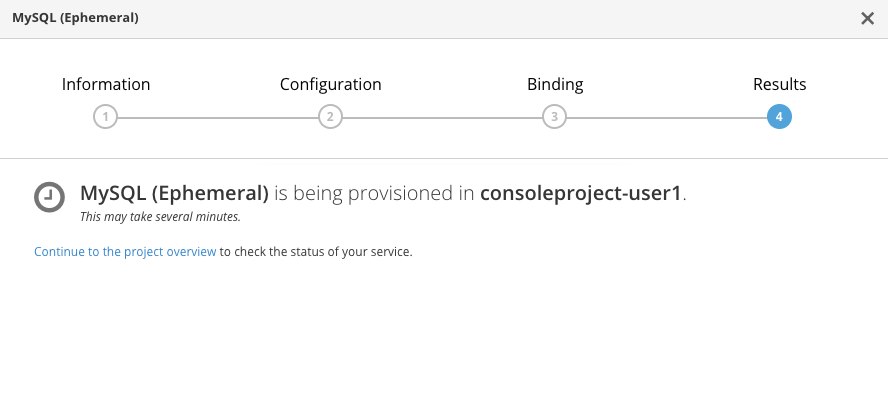
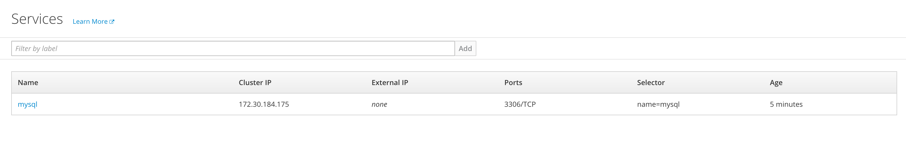
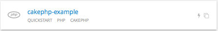
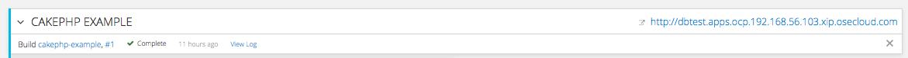

## Using Templates

In this lab exercise we will learn to use OpenShift Web Console to spin up a MySQL database using templates. We will then add a frontend PHP application that accesses this database using the service exposed by the database. We will provide a route (a URL) to access the frontend application from a browser.

**Step 1: Create a Project**

Based on the experience gained from the previous exercise, log into the OpenShift Web Console. You will see the list of Projects.

Using the **New Project** button, create a new project. We will call it **consoleproject-UserName**. Replace by your username to make this project unique. Type in a **Display Name** and **Description** of your choice.

Press the **Create** button to complete the project creation from the Web Console. This will accomplish the same job as `oc new-project` from CLI.

**Step 2: Create a MYSQL database using the template**

Click on **Add to Project** button and you will be taken to select an image or template. You will see the application create screen as shown below:


Scroll down to Databases session, click **See all** to see the list of all the available database templates. Select **mysql-ephemeral** template from the list by click onto the link. You will also notice **mysql-persistent** template. But we will address that in a different lab exercise.


You will be taken to the mysql ephemeral creation screen. Click edit parameters and edit the values to use the following values:

```
Database Service Name: mysql
MySQL Connection Username: mysqluser
MySQL Connection Password: supersecret
MySQL Database Name: sample
```

In the next section you can add the label:

```
name=name
value=mysql
```

Click the **Create** button.


Click **Go to overview**.



It will take you back to the project overview page and soon you will see an image of a running pod.


If pod does not show running, Click **Applications** and select **Deployments**, do the following:

1. Click onto `mysql` deployments config
2. Click on the **Actions** button and select **Edit Health Checks**
3. Under the Readiness Probe section remove the single quotes around $MYSQL_PASSWORD
4. Click **Save**
5. Click **Applications** and select **Pods**
6. Click onto the pod name
7. Click on the **Actions** button and select **Delete**


Browse over to Pods, Services and Deployments from the **Applications** tab to notice the additions to the project. You will note that the service has been assigned an IP address that starts with `172.*`. Make a note of that. Also note the port that is exposed by this service. By default it exposes `3306`.



**Step 3: Add data to MySQL database**

Let us see how we can enter the pod and access the database.

From the command line, change the project to the "consoleproject-UserName" using the following command:

**Remember** to substitute your username.

````
 oc project consoleproject-UserName
````

Based on what you learned previously get the list of running pods (Tip: `oc get pods`). You will find one pod for mysql running. Take a note of it's name.

Enter the pod by running the following command. Substitute the pod name with your mysql pod name.

````
$ oc rsh mysql-1-aewve

bash-4.2$
````

You will be taken to a bash prompt inside the running pod. Now using the service ip address you noted earlier, port number, username and password you used start the mysql client as shown below. You will have to substitute your values here.

*Tip:* If you need service ip address navigate to **Applications->Services** tab on the Web Console.

````
mysql -h172.30.5.210 -P3306 -umysqluser -psupersecret
````

You will be taken to the `mysql` prompt. See the list of databases. You will notice that the sample database that you requested is added and available.

````
mysql> show databases;
+--------------------+
| Database           |
+--------------------+
| information_schema |
| sample             |
+--------------------+
2 rows in set (0.00 sec)
````

Change over to use the `sample` database.

````
mysql> use sample;
Database changed
````

Now `show tables` shows an empty set. So let us create a table and add some records using the commands shown below.

Create the table:

````sql
create table users (user_id int not null auto_increment, username varchar(200),PRIMARY KEY(user_id));
````

Now we add some data:

````sql
insert into users values (null, 'joe');
insert into users values (null, 'alice');
````

Verify that the records you added are there

````sql
select * from users;
````

Now `exit` MySQL client and `exit` out of the pod.


**Step 4: Add a PHP frontend to talk to this database**

In this step we will add a PHP frontend application that talks to recently create database. The code is available on github to use at https://github.com/VeerMuchandi/dbtest.

Browse through the code in this repository. It has a simple php file (`dbtest.php`) that connects to the database and reads the values from the users table and displays them.

To add a frontend again click on **Add to Project** to spin up a frontend application in the same **consoleproject-UserName**. It takes you to select image or template page and choose the **cakephp-example** template under PHP apps.



You will be taken to the screen where you can edit the template defaults like before. Enter the following values for each parameters:

```
* Git Repository URL: https://github.com/VeerMuchandi/dbtest.git
* Application Hostname: dbtest.UserName.apps.osecloud.com
(Remember to substitute username)
* Database Service Name: mysql (this should match the service name for database created earlier)
* Database Engine: mysql
* Database Name: sample
* Database User: mysqluser (the value we set earlier)
* Database Password: supersecret (the value we set earlier)
```

In the next section add a label:

```
* name=name
* value=dbtest
```

Click **Create** to add this frontend application to talk to the database.


Click **Continue to overview**.

You will be taken back to the Project Overview page and you will start seeing that a new service is now available and exposed as a route.



You will also notice that a build starts running very soon. Once the build completes, the application image created from the source code will be uploaded to the docker repository.


You can check the build logs using the following command:

````
$ oc logs build/cakephp-example-1

Cloning "https://github.com/VeerMuchandi/dbtest.git" ...
	Commit:	1bb0515221459a11ca2e7563dca903bb93d8150e (small change)
	Author:	VeerMuchandi <veer.muchandi@gmail.com>
	Date:	Tue Jan 26 12:53:35 2016 -0500

---> Installing application source...


Pushing image 172.30.89.28:5000/consoleproject-admin/cakephp-example:latest ...
Pushed 0/5 layers, 7% complete
Pushed 1/5 layers, 21% complete
Pushed 2/5 layers, 41% complete
Pushed 3/5 layers, 70% complete
Pushed 3/5 layers, 99% complete
Pushed 4/5 layers, 100% complete
Pushed 5/5 layers, 100% complete
Push successful
````
Once the build completes, OpenShift initiates a deploy process. Once the deployment is complete, the frontend pod starts running. You will find the running pod when you navigate to **Applications->Pods** on the Web console.

Now type in your application url in the browser or use curl with `http://<<your application url>>/dbtest.php`

You will notice that it displays the records read from the database

````
Hello All.. Here is the list of users:
User Id: 1 User Name: joe
User Id: 2 User Name: alice
End of the list

````

In this lab exercise you have seen a complete web application deployed using OpenShift templates in two parts.
First we deployed the MySQL database. We added data manually by getting into the pod.
Then we added the frontend code that was built using the OpenShift S2I process.
You configured this frontend application to access the database using a service, in this case, the "mysql" service.
The frontend is made accessible using a route for which you gave a URL.
