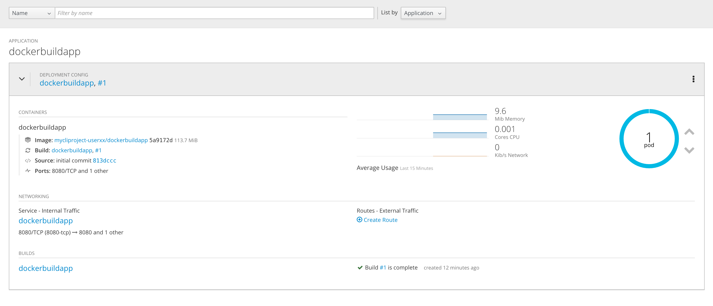
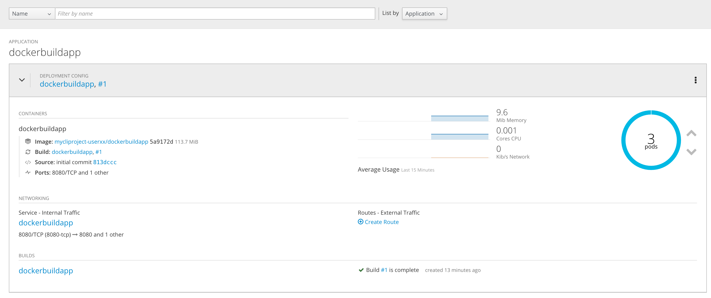

[[scale-up-and-scale-down-and-idle-the-application-instances]]
Scale up and Scale down and Idle the application instances
~~~~~~~~~~~~~~~~~~~~~~~~~~~~~~~~~~~~~~~~~~~~~~~~~~~~~~~~~~

In this exercise we will learn how to scale our application. OpenShift
has the capability to scale your application and make sure that many
instances are always running.

*Step 1: Switch to an existing project*

For this exercise, we will be using an already running application. We
will be using the `mycliproject-UserName` that you created in the
previous labs. Make sure you are switched to that project by using the
`oc project` command and *remember* to substitute UserName.

....
$ oc project mycliproject-UserName
....

*Step 2: View the deployment config*

Take a look at the `deploymentConfig` (or `dc`) of the `time`
application

....
$ oc get deploymentConfig/time -o yaml

apiVersion: v1
kind: DeploymentConfig
metadata:
  annotations:
    openshift.io/generated-by: OpenShiftNewApp
  creationTimestamp: 2016-10-06T05:47:52Z
  generation: 2
  labels:
    app: time
  name: time
  namespace: mycliproject-admin
  resourceVersion: "32084"
  selfLink: /oapi/v1/namespaces/mycliproject-admin/deploymentconfigs/time
  uid: 6bb299e0-8b88-11e6-ba5b-080027782cf7
spec:
  replicas: 1
  selector:
    app: time
    deploymentconfig: time
  strategy:
    resources: {}
    rollingParams:
      intervalSeconds: 1
      maxSurge: 25%
      maxUnavailable: 25%
      timeoutSeconds: 600
      updatePeriodSeconds: 1
    type: Rolling
  template:
    metadata:
      annotations:
        openshift.io/container.time.image.entrypoint: '["sh"]'
        openshift.io/generated-by: OpenShiftNewApp
      creationTimestamp: null
      labels:
        app: time
        deploymentconfig: time
    spec:
      containers:
      - image: 172.30.89.28:5000/mycliproject-admin/time@sha256:c490ea632c5362be3a3985285c623e674e58b876e70d9e3f94a151785b2ee87c
        imagePullPolicy: Always
        name: time
        ports:
        - containerPort: 8080
          protocol: TCP
        resources: {}
        terminationMessagePath: /dev/termination-log
      dnsPolicy: ClusterFirst
      restartPolicy: Always
      securityContext: {}
      terminationGracePeriodSeconds: 30
  test: false
  triggers:
  - type: ConfigChange
  - imageChangeParams:
      automatic: true
      containerNames:
      - time
      from:
        kind: ImageStreamTag
        name: time:latest
        namespace: mycliproject-admin
      lastTriggeredImage: 172.30.89.28:5000/mycliproject-admin/time@sha256:c490ea632c5362be3a3985285c623e674e58b876e70d9e3f94a151785b2ee87c
    type: ImageChange
status:
  availableReplicas: 1
  details:
    causes:
    - imageTrigger:
        from:
          kind: ImageStreamTag
          name: time:latest
          namespace: mycliproject-admin
      type: ImageChange
    message: caused by an image change
  latestVersion: 1
  observedGeneration: 2
  replicas: 1
  updatedReplicas: 1
....

Note that the `replicas:` is set to `1`. This tells OpenShift that when
this application deploys, make sure that there is 1 instance.

The `replicationController` mirrors this configuration initially; the
`replicationController` (or `rc`) will ensure that there is always the
set number of instances always running.

To view the `rc` for your application first get the current pod running.

....
oc get pods

NAME           READY     STATUS      RESTARTS   AGE
time-1-45jtc   1/1       Running     0          2h
time-1-build   0/1       Completed   0          2h
....

This shows that the build `time-1` is running in pod `45jtc`. Let us
view the `rc` on this build.

....
$ oc get rc/time-1

NAME      DESIRED   CURRENT   AGE
time-1    1         1         2h
....

*Note:* You can change the number of replicas in `DeploymentConfig` or
the `ReplicationController`.

However note that if you change the `deploymentConfig` it applies to
your application. This means, even if you delete the current replication
controller, the new one that gets created will be assigned the REPLICAS
value based on what is set for DC. If you change it on the Replication
Controller, the application will scale up. But if you happen to delete
the current replication controller for some reason, you will loose that
setting.

*Step 3: Scale Application*

To scale your application we will edit the `deploymentConfig` to 3.

Open your browser to the Overview page and note you only have one
instance running.

Now scale your application using the `oc scale` command (remembering to
specify the `dc`)

....
$ oc scale --replicas=3 dc/time
deploymentconfig "time" scaled
....

If you look at the web console and you will see that there are 3
instances running now

*Note:* You can also scale up and down from the web console by going to
the project overview page and clicking twice on
image::scale_up.jpg[image] right next to the pod count circle to
add 2 more pods.

On the command line, see how many pods you are running now:

....
$ oc get pods

NAME           READY     STATUS      RESTARTS   AGE
time-1-33wyq   1/1       Running     0          10m
time-1-45jtc   1/1       Running     0          2h
time-1-5ekuk   1/1       Running     0          10m
time-1-build   0/1       Completed   0          2h
....

You now have 3 instances of `time-1` running (each with a different
pod-id). If you check the `rc` of the `time-1` build you will see that
it has been updated by the `dc`.

....
$ oc get rc/time-1

NAME      DESIRED   CURRENT   AGE
time-1    3         3         3h
....

*Step 4: Idling the application*

Run the following command to find the available endpoints

....
$ oc get endpoints
NAME      ENDPOINTS                                            AGE
time      10.128.0.33:8080,10.129.0.30:8080,10.129.2.27:8080   15m
....

Note that the name of the endpoints is `time` and there are three ips
addresses for the three pods.

Run the `oc idle endpoints/time` command to idle the application

....
$ oc idle endpoints/time
Marked service mycliproject-veer/time to unidle resource DeploymentConfig mycliproject-veer/time (unidle to 3 replicas)
Idled DeploymentConfig mycliproject-veer/time (dry run)
....

Go back to the webconsole. You will notice that the pods show up as
idled.

image::images/idled_pods.jpeg[image]

At this point the application is idled, the pods are not running and no
resources are being used by the application. This doesn’t mean that the
application is deleted. The current state is just saved.. that’s all.

*Step 6: Reactivate your application* Now click on the application route
URL or access the application via curl.

Note that it takes a little while for the application to respond. This
is because pods are spinning up again. You can notice that in the web
console.

In a little while the output comes up and your application would be up
with 3 pods.

So, as soon as the user accesses the application, it comes up!!!

*Step 7: Scaling Down*

Scaling down is the same procedure as scaling up. Use the `oc scale`
command on the `time` application `dc` setting.

....
oc scale --replicas=1 dc/time

deploymentconfig "time" scaled
....

Alternately, you can go to project overview page and click on
image::scale_down.jpg[image] twice to remove 2 running pods.

Congratulations!! In this exercise you have learned about scaling and
how to scale up/down your application on OpenShift!

link:0_toc.adoc[Table Of Contents]
