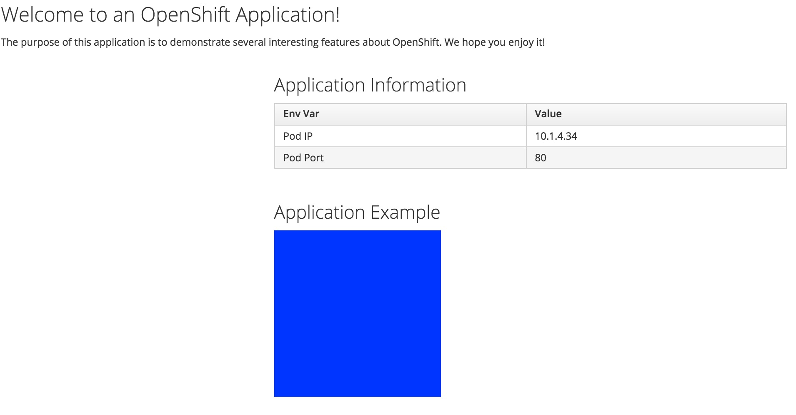
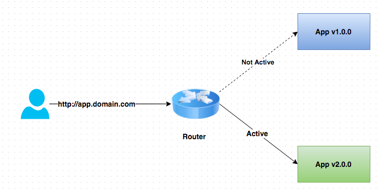
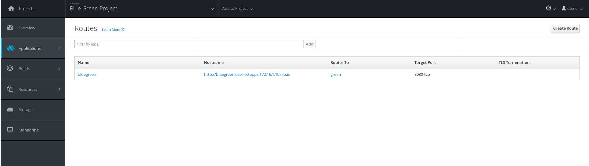
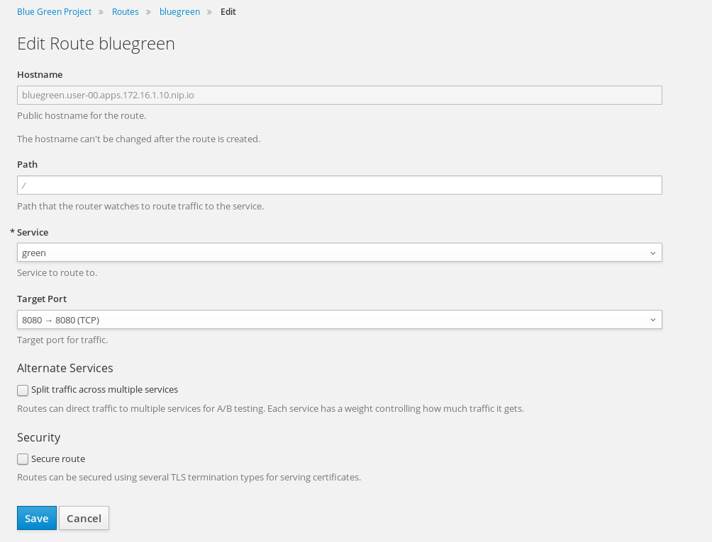
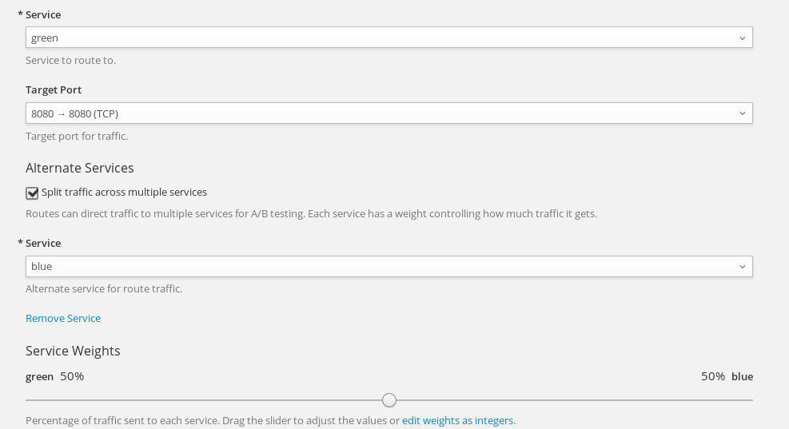
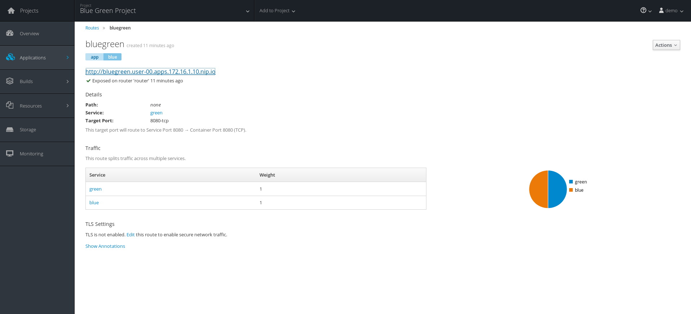

[[blue-green-deployments]]
Blue-Green Deployments
~~~~~~~~~~~~~~~~~~~~~~

The purpose of this short lab is to demonstrate how simple it is to
implement Blue-Green Deployments in OpenShift v3.

----
Blue-green deployment is a release strategy that can be utilized by
developers for deploying software in a production environment. Blue can
be one particular production environment whereas green can define an
identical production environment. Under blue-green deployment strategy,
software developers are able to minimize downtime and reduce risk.
https://en.wikipedia.org/wiki/User:Nuqing/Blue-green_deployment[1*]
----

In this Lab, we will be:

* Deploying two versions of the same application. The first version will
display a blue rectangle.
* Create a FQDN that can be used to expose the applications.
* We will first expose the first application.
* We will also create another version of this application in the same
project that displays a green rectangle.
* We will then switch the FQDN to from the first application (blue) to
the second application (green).

image::images/blue_green_deployment.png[image]

[[part-i]]
Part I
^^^^^^

*Step 1: Create a new project*

*Remember* to substitute the username

....
$ oc new-project bluegreen-UserName --display-name="Blue Green Project" --description="Blue Green Project"
....

*Step 2: List existing image builder or image streams*

....
$ oc new-app -S --image-stream=php

Image streams (oc new-app --image-stream=<image-stream> [--code=<source>])
-----
php
  Project: openshift
  Tags:    5.5, 5.6, latest
....

*Step 3: Create an application*

We will be using a sample application that displays a blue or green
rectangle. The sample app can be browsed at
https://github.com/RedHatWorkshops/bluegreen

We will be using an env var in order to change the color of the box; but
in practice you would use a different branch for each version of the
code. (E.g. v1 branch and v2 branch)

....
$ oc new-app --image-stream=php --code=https://github.com/RedHatWorkshops/bluegreen --env COLOR=blue --name=blue
....

*Step 4: Monitor the application build*

....
$ oc get builds

NAME      TYPE      FROM          STATUS     STARTED              DURATION
blue-1    Source    Git@afdc492   Complete   About a minute ago   1m8s
....

Using the build name of the recently created application run:

....
$ oc logs build/blue-1
....

Once the build finishes you should see something similar to:

....
...
---> Installing application source...

Pushing image 172.30.89.28:5000/bluegreen-admin/blue:latest ...
Pushed 0/5 layers, 2% complete
Pushed 1/5 layers, 24% complete
Pushed 2/5 layers, 46% complete
Pushed 3/5 layers, 68% complete
Pushed 3/5 layers, 100% complete
Pushed 4/5 layers, 100% complete
Pushed 5/5 layers, 100% complete
Push successful
....

*Step 5: Check application deployment status*

....
$ oc get pods

NAME           READY     STATUS       RESTARTS   AGE
blue-1-build   0/1       Completed    0          4m
blue-1-ruyrt   1/1       Running      0          19s
....

Notice that the build pod has exited and you now have a single instance
of the application running under one single pod.

This application displays a blue square.

*Step 6: List the service*

....
$ oc get service
....

*Step 7: Create a route for the application*

*Remember* to substitute the username. Expose the service:

....
$ oc expose service blue --hostname=bluegreen.UserName.apps.workshop.osecloud.com --name=bluegreen
....

*Step 8: Test the application*

....
$ oc get route
....

Copy the HOST/PORT and paste it in your browser. You should see
something similar to:

At this point you have deployed an application that displays for
illustration purposes a blue rectangle for version 1.

[[part-ii]]
Part II
~~~~~~~

In this part, we will:

* Deploy a new version of this application (Same one as before with a
very small change)
* Point the previously created FQDN (route) to the new service that will
be created as part of the new application creation process.

*Step 1: Create new version of the application*

Create a new application the same way as you did above in Part I. Make
sure to name the application as `green' this time.

....
$ oc new-app --image-stream=php --code=https://github.com/RedHatWorkshops/bluegreen --env COLOR=green --name=green
....

* Wait until the application is built and deployed. You should now see
two services if you run:

....
$ oc get service

NAME      CLUSTER-IP       EXTERNAL-IP   PORT(S)    AGE
blue      172.30.2.161     <none>        8080/TCP   24m
green     172.30.136.184   <none>        8080/TCP   1m
....

* Edit the previously created route and change the `service` name (from
`blue` to `green`), all the way at the bottom to the new service that
was just created. You are essentially still using the FQDN you had
previously created. However, that route will now point to a different
(green) service.

....
$ oc edit route bluegreen

apiVersion: v1
kind: Route
metadata:
  creationTimestamp: 2015-12-22T19:16:28Z
  labels:
    app: green
  name: bluegreen
  namespace: bluegreen-UserName
  resourceVersion: "2969408"
  selfLink: /oapi/v1/namespaces/bluegreen-UserName/routes/bluegreen
  uid: 80829b59-a8e0-11e5-be21-fa163ec58dad
spec:
  host: bluegreen.UserName.apps.workshop.osecloud.com
  port:
    targetPort: "8080"
  to:
    kind: Service
    name: green
status: {}
....

*Step 2: Test the application*

....
$ oc get route
....

* Copy the HOST/PORT and paste it in your browser.
* You should now see the new version of the recently deployed
application with a green rectangle.

[[part-iii]]
Part III
~~~~~~~

You can route traffic to both services. This is also known as "cannary in a colemine".

*Step 1: Edit Your Route*
Using the lefthand side navigation; click on *Applications -> Routes*. This will
bring you to the `Route` overview page.

Here, click on the  `bluegreen` route. The page after will display the current configuration.
On the upper right hand side, click on *Actions -> Edit*. You should see a page similar to
this one.

Next, tick on `Split traffic across multiple services`

image::images/g-slipt-traffic.png[image]

Here, set the weight to 50% on blue and 50% on green. This will make it to where half the
traffic will go to the green application and half to the blue application.

Once you click on *Save*; you should see this on the Route Overview page.

*Step 2: Test Your Settings*

If you try and visit your application; you'll notice it won't "switch" over
to the other application. This is because the default behavior is:

* Sticky Session on the Router
* Session Cookie set on the router

To get "true" round robin; annotate your route with the following

....
oc annotate route/bluegreen haproxy.router.openshift.io/balance=roundrobin
oc annotate route/bluegreen haproxy.router.openshift.io/disable_cookies=true
....

[[summary]]
Summary
~~~~~~~

* Blue-Green deployments can be easily accomplished in OpenShift v3.
* We have shown multiple versions of an application; all running
concurrently, each with a unique service.
* All that is needed to expose any of the applications is to change the
service being used by the route to publicly advertise the application.
* You can split traffic accross two services

link:0_toc.adoc[Table Of Contents]
